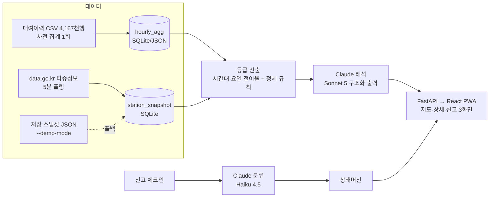

# 타슈캐스트(TashuCast) — 기획·디자인·개발 통합 계획서

> **문서 상태: 이전 해커톤안.** 현재 구현 기준은 [`docs/v2/README.md`](./v2/README.md)다. 이 문서는 배경과 당시 의사결정을 보존하기 위해 유지한다.

> **2026 AI 기반 해커톤 썸머 캠프**(2026-07-21~22, 충남대 융합교육혁신센터) 실행 계획서.
> 한 줄 정의: **"앱에는 있다는데 가보면 없다"** — 타슈 이용자의 헛걸음을 없애기 위해, 도착 시점의 실질 이용 가능성을 시계열 AI가 등급으로 예측하고, 고장 의심 신호를 감지하며, LLM(Claude)이 근거·대안을 사람의 언어로 설명하고, 이용자 신고(체크인)로 검증하는 서비스.
>
> 근거 문서: `docs/research/` — 리서치 R1~R4, 섹션 초안 D1~D3, 정합성 검증 V1 (Sonnet 5 서브에이전트 8개 산출물). 본문의 [확인]/[추정] 태그는 리서치 원문의 검증 상태를 그대로 따른다. 검증 V1의 수정 지시 10건은 본 문서에 반영 완료(§5.2).

---

## 0. 전제가 되는 사실 (리서치 핵심 요약)

| # | 사실 | 상태 | 계획에 미치는 영향 |
|---|---|---|---|
| 1 | 타슈 실시간 API(`bikeapp.tashu.or.kr:50041/v1/openapi/station`)는 정류장 단위 6개 필드만 제공: `id, name, x_pos(위도), y_pos(경도), address, parking_count` | [확인] R1 — 독립 리포 6개+ 교차검증 | 개별 자전거 ID·고장 여부·거치대 용량 필드 **없음** → "고장 확정"은 원리적으로 불가, **추정 + 사람 검증** 구조가 필수 |
| 2 | 타슈 직접 API 토큰은 앱 내 신청 → **수동 승인**, 소요기간·호출한도 비공개 | [확인] R1 | 해커톤 2일 안에 승인을 기대할 수 없음 → 주 경로로 삼지 않는다 |
| 3 | data.go.kr `대전광역시_타슈정보`(15109253)는 **자동승인, 개발계정 10,000회/일** 명시 | [확인-문구] R1 | **해커톤의 주 데이터 경로.** 단, 직접 API와 동일 데이터인지는 [불명] — 1일차에 실응답으로 검증 |
| 4 | 대여이력 CSV(15137219): **4,168,667행**, 자전거번호·대여/반납 일시·대여소·좌표·이용시간/거리 포함, 연 1회 갱신(최신 2026-03-31자), EUC-KR 인코딩 | [확인] R1 | 시계열 모델 학습 데이터를 **지금 즉시** 확보 가능 — 실시간 수집 대기 불필요 (콜드스타트 해결) |
| 5 | `x_pos`가 위도, `y_pos`가 경도 (필드명과 의미가 뒤바뀜) | [확인] R1 | 지도 연동 시 1순위 함정 |
| 6 | 거치대 총 용량(도크 수) 필드는 실시간 API·이력 CSV 어디에도 없음 | [확인] R1 | "빈 거치대(반납) 예측"은 근거 데이터 부재 → **Stretch로 강등** (기존 타슈캐스트 아이디어 문서의 "대여·반납 성공 가능성" 중 반납 파트는 수정 필요) |
| 7 | 서드파티 `Jeric1223/TASHU-OPTIMAL-ROUTE-FINDER`가 GitHub Actions 크론으로 5분 주기 station JSON을 수집·공개 | [확인] R1 | 데모 폴백용 실측 샘플 JSON + 수집 패턴 참고 가능 |
| 8 | 고장 유형: 잠금 불가, 파손, 배터리(잠금장치·GPS 구동용) 소진 — 태양광 패널 가림 사례, 반납했는데 미반납 표기 등 | [확인] R2 (민원·언론 사례) | 문제 정의의 실증 근거. 단 "정상 반납→미반납 표기" 유형은 집계 데이터로 감지 불가 → 신고 체크인만이 잡을 수 있음 |

---

## 1. 해커톤 전략 (1일차 = 오늘 7/21)

### 1.1 심사 배점 역산 → 문서·데모가 증명해야 할 것

**예선 서류 100점** (`KnuSoftHackerton/texts/04_심사기준.md`):

| 심사 영역 | 배점 | 이 계획서의 대응 | 데모에서 보여줄 것 |
|---|---:|---|---|
| 문제 정의의 명확성 | 30 | §2.1 (누구·어디·언제 + API 데이터 공백이라는 구조적 원인) | 실제 API 응답에 고장 필드가 없다는 화면 1장 |
| 시장성 | 15 | §2.2 (시민 무료 + 기관 대시보드 B2G) | — |
| 해결 방향의 적절성 | 20 | §2.4 (AI 필연성: 예측+감지+설명 3중 활용) | — |
| MVP 실현 가능성 | 15 | §2.5 (Core 1, Supporting 2, 입출력·완료기준 수치화) | — |
| 결과물·완성도 기대 | 12 | §1.5 (90초 데모 시나리오, 측정 지표) | 등급 예측→설명→신고→상태 변경 E2E |
| 팀 구성·실행력 | 8 | §1.4 (역할 분담이 드러나는 시간표) | — |

**본선 100점**: 실용성·시장성 **35** + AI활용도 **25**가 60%. 따라서 발표의 중심축은 ① "헛걸음"이라는 보편적 실용 문제 + 대전교통공사 B2G 확장성, ② AI 3중 활용(시계열 예측 모델 + 이상 감지 + LLM 해석·분류)이다. 창의성 15점은 "예측"만 하는 유사 서비스(pcu-tashu-dev 등 선행 사례 존재 [확인] R1)와 달리 **고장 감지·체크인 검증 루프**를 결합했다는 차별점으로 확보한다.

### 1.2 기능 확정 — Core 1 / Supporting 2 / Stretch

작성 가이드 "Core 1개, Supporting 최대 2개, 복잡 기능 최소화"에 맞춰 확정한다. 기존 `ideas/04_타슈캐스트.md`의 Core를 계승하되, 이번에 설계한 고장 감지·체크인을 Supporting으로 통합한다.

| 구분 | 기능 | AI 입출력 (심사 양식 그대로) |
|---|---|---|
| **Core** | **"지금 가면 빌릴 수 있어요?" — 도착 시점(15분 뒤) 대여 성공 가능성 등급 + 설명** | 입력: 정류장, 현재 `parking_count`, 요일·시간대, 과거 이력 집계(4,167천 행 CSV), 고장 의심 신호 → 분석: 시간대별 수요 예측(경량 모델) + 정체 감지 → 출력: **낮음/보통/높음 등급 + 근거 2개 + 대안 정류장 1곳 + 출발 행동** (Claude 자연어 생성) |
| **Supporting 1** | **고장 의심 자동 감지 배지** — "수량에는 잡혀 있지만 실제론 못 쓸 가능성" 표시 | 입력: 정류장별 재고 시계열(정체 시간, 인접 정류장 대비 회전율) → 분석: 규칙 기반 정체 탐지 → 출력: 고장의심(AI) 배지 + 신뢰도(낮음/중간/높음) + Claude가 생성한 2문장 근거 |
| **Supporting 2** | **신고 체크인** — 이용자가 현장에서 고장을 신고하면 상태가 즉시 반영·추적됨 | 입력: 정류장 + 유형 선택 + 자유 텍스트 → 분석: Claude(Haiku)가 고장유형·긴급도 분류 → 출력: 신고접수 배지, 상태 전이(접수→의심→해소), 내 신고 상태 추적 |
| Stretch | 운영자 카드(다음 30분 부족·고장의심 상위 5) + LLM 일일 브리핑 / 날씨 반영 / 반납(빈 거치대) 예측(용량 필드 부재로 관측 최댓값 근사 필요 [확인] §0-6) | — |

**기존 아이디어 문서 대비 변경점** (제출서 갱신 시 반영):
1. "대여·**반납** 성공 가능성" → 반납 파트는 Stretch로 강등 (근거: §0-6 거치대 용량 필드 부재).
2. Supporting이 "대안 추천 + 운영자 카드"에서 "**고장 감지 + 신고 체크인**"으로 교체 — 대안 추천은 Core 출력에 흡수, 운영자 카드는 Stretch로.
3. 데이터 근거 문구 중 "실시간 API가 거치대 수 제공"은 실측과 상충하므로 삭제·수정.

### 1.3 데이터 확보 전략 (최대 리스크를 1일차 첫 작업으로)

우선순위 순서대로, 앞이 막히면 즉시 다음으로 폴백:

1. **data.go.kr `대전광역시_타슈정보`(15109253) 활용신청** — 자동승인, 10,000회/일 [확인-문구]. 발급 즉시 실응답 스키마 검증(§0-3의 [불명] 해소).
2. **대여이력 CSV(15137219) 즉시 다운로드** — 4,167천 행. `cp949`로 읽고, 충남대 주변 정류장 5~10곳 × 시간대·요일별 대여/반납 건수로 사전 집계 (전체 CSV를 프론트에 싣지 않는다).
3. **타슈 직접 API 토큰은 오늘 신청만 해두고 의존하지 않는다** (수동승인 [확인]).
4. **데모 폴백**: 실시간 API가 안 되거나 시연장 네트워크가 불안하면 저장된 스냅샷 JSON으로 구동 — 앱 시작 옵션 `--demo-mode`로 전환 가능하게 처음부터 설계한다 (선택 규칙 3: "외부 API가 실패해도 로컬 샘플로 데모 가능").

### 1.4 2일 시간표

| 시간 | 목표 | 산출물 |
|---|---|---|
| **1일차 오후** | 데이터 확보(§1.3 1~3) + CSV 사전 집계 + 문제 문장 확정, 현장 사용자 3명 인터뷰(충남대 정류장 앞) | `stations.json`(대상 5~10곳 메타), `hourly_agg.parquet/json`(시간대·요일 집계), 인터뷰 메모 |
| **1일차 저녁** | Core 파이프라인: 등급 산출 함수(집계 기반) + Claude 설명 생성(구조화 출력) + API 서버 골격 | `GET /stations/{id}/forecast` 동작 (고정 입력→출력) |
| **1일차 밤** | 화면 1·2(지도 뷰, 정류장 상세) + Supporting 1(정체 감지 규칙) + 데모 폴백 모드 | 시연 가능한 첫 E2E |
| **2일차 오전** | Supporting 2(신고 체크인 플로우 + Haiku 분류 + 상태 배지 반영) + 사용자 3명 재테스트 → 문구·흐름 수정 | 신고→배지 변경 E2E, 측정 결과 기록(완료 기준 §2.5 대조) |
| **2일차 오후** | 발표 자료 + 90초 시연 리허설 + 백업 영상/스크린샷 | 발표 덱, 데모 영상 |

역할 분담(팀 심사 8점): 기획(문제·인터뷰·발표) / 디자인(화면 3개·배지 체계) / 개발A(데이터·모델·API) / 개발B(프론트·신고 플로우) / AI(Claude 프롬프트·스키마·검증). 인원이 적으면 개발A+AI 겸임.

### 1.5 90초 데모 시나리오

1. (10초) 타슈 공식 앱 화면: "3대 이용가능" → 현장 사진: 전부 잠금 불가. "이 괴리가 문제입니다."
2. (25초) 타슈캐스트 지도 뷰: 같은 정류장에 **고장의심(AI) 배지 + 신뢰도 중간**. 탭 → "지난 38분간 회전이 없고 인근 정류장은 정상 순환 중 — 잠금 오류 의심" (Claude 생성 근거 2문장) + "270m 옆 ○○정류장은 등급 '높음'" 대안 제시.
3. (25초) 15분 뒤 도착 예정으로 조회 → 등급 낮음/보통/높음 + 출발 행동 문구. "예측은 과거 416만 건 이력과 현재 수량으로 계산됩니다."
4. (20초) 현장에서 신고 체크인: 유형 선택 + 한 줄 입력 → Haiku가 분류 → 배지가 '신고접수'로 즉시 변경, 다른 사용자 화면에도 반영.
5. (10초) (Stretch 완성 시) 운영자 카드: "다음 30분 부족 예상 상위 5곳" — B2G 확장 한 컷.

---

## 2. 1부 — 기획

### 2.1 문제 정의 (심사 I. 30점 대응)

**템플릿 문장** (공고 전략 §5 양식):

> **타슈로 통학하는 충남대 학생**은 **평일 오전 수업 직전, 궁동·어은동~충남대 구간 정류장**에서 **앱에 '이용가능'으로 표시된 자전거를 믿고 이동했다가 실제로는 빌릴 수 없는 상황**(잠금 불가·파손·배터리 소진, 또는 도착 직전 소진)을 겪는다. 현재는 **타슈 공식 앱의 현재 수량 표시**에 의존하지만, ① 앱은 미래 상태를 알려주지 않고 ② 고장 자전거도 수량에 그대로 집계되기 때문에 문제가 반복된다. **공개 대여이력 4,168,667행**[확인]과 **고장·미반납 오표기 민원 사례**[확인 R2], 그리고 **현장 인터뷰 3명**(1일차 확보)은 이 문제가 일회성이 아님을 보여준다.

**구조적 원인** (차별화 포인트 — "왜 타슈가 못 고치나"가 아니라 "왜 데이터가 못 잡나"):
- 실시간 API는 정류장 집계값(`parking_count`) 하나뿐 — 고장 자전거도 정상과 똑같이 "1대"로 집계된다 [확인 §0-1].
- 참고로 국제 표준 GBFS에는 `num_vehicles_disabled` 같은 고장 대수 분리 필드가 존재한다 — 타슈의 공백은 기술 한계가 아니라 공개 정책의 공백이며 [추정 R2], 우리가 통계 추정 + 시민 신고로 메울 수 있는 영역이라는 뜻이다.

### 2.2 시장성 (심사 II. 15점)

- **이용자 규모 대리 지표**: 타슈 정류장 약 1,000개소(2026년 1,500개소 확대 계획) [확인 R3], 연간 대여 4,167천 건(공개 이력 기준) [확인].
- **가격**: 시민 무료(공공데이터 기반 보조 서비스). **지불 주체는 기관** — 대전교통공사·지자체 대상 운영 최적화 대시보드(고장 의심 우선 점검 큐, 재배치 부족 예보)를 B2G 파일럿으로 제안. 정비 인력의 순회 우선순위를 데이터로 제공하는 것이 기관 측 효용.
- **확장성**: 조사된 타 지자체 공영자전거(따릉이·어울링·타조 등)에서 동일한 "집계값만 공개, 고장 필드 부재" 패턴 확인 [확인 R2] → 대전 검증 후 타 지자체 이식 가능한 구조.

### 2.3 핵심 사용자

단일 집단으로 좁힌다(체크리스트: "핵심 사용자 한 집단만"): **타슈로 통학·출퇴근하며 정해진 시간에 도착해야 하는 반복 이용자** (1차 페르소나: 충남대 통학생). 정비·운영자와 서비스 관리자는 확장 페르소나로 §4.7 로드맵에서 다룬다.

### 2.4 해결 방향과 AI 필연성 (심사 20점, 본선 AI활용도 25점)

**AI를 빼면 이 서비스는 성립하지 않는다** — 세 지점 모두에서:

| AI 활용 | 무엇을 하나 | 왜 AI여야 하나 |
|---|---|---|
| ① 시계열 예측 | 과거 이력 + 현재 수량 → 15분 뒤 가용성 등급 | 정류장·시간대·요일별 패턴은 규칙 나열로 커버 불가. 사람은 "경험상 이 시간엔 없다"를 새 장소에 일반화하지 못함 |
| ② 이상(고장 의심) 감지 | 정체 시간·인접 정류장 대비 회전율로 "수량에 잡혀 있으나 순환에서 이탈한" 신호 탐지 | 고장 필드가 없는 데이터에서 고장을 유추하는 것 자체가 통계적 추론 문제 |
| ③ LLM 해석·분류 (Claude) | 수치 신호 → 사람이 읽는 근거 2문장 + 행동 제안, 신고 텍스트 → 유형·긴급도 분류 | "잔차 -2.3σ, 정체 38분"을 시민이 읽을 수 없음. 반대로 LLM은 수치를 **재계산하지 않고 설명만** 하도록 역할 제한(§4.4) — 이 역할 분리가 환각 억제 설계의 핵심 |

사용자가 얻는 변화: "가서 확인"에서 "**보고 결정**"으로 — 헛걸음(빈 정류장·고장 자전거 조우) 감소, 신고가 방치되지 않고 상태로 추적됨.

### 2.5 완료 기준 (심사 IV. 12점 — 측정 가능하게)

| 기능 | 완료 기준 |
|---|---|
| Core 예측·설명 | 이력 데이터 마지막 기간을 테스트셋으로, **단순 기준선(현재값 유지 가정) 대비 오류 감소** 확인. 준비된 테스트 사례 10개 중 **8개 이상**에서 등급+근거+대안을 **10초 이내** 생성, **3번 이하 조작**으로 출발 결정 가능. 결과에 예측 기준시각·불확실성(신뢰도 등급) 표시 |
| Supporting 1 감지 | 시연 시나리오용 정체 케이스(실측 또는 재현 데이터)에서 배지·근거 2문장 정상 노출. "왜 이 정류장을 피해야 하는지" 2문장 설명 |
| Supporting 2 체크인 | 신고 제출→분류→배지 변경→다른 클라이언트 반영까지 E2E **30초 이내**. 잘못된 신고 취소 가능 |

> 정확도 수치 목표(예: "90%")는 데이터 분포를 본 뒤에만 확정한다 — 근거 없는 선행 목표 금지 (기존 아이디어 문서의 원칙 유지).

### 2.6 KPI (포스트 해커톤 포함)

- **감지 정밀도 Precision@k**: 상위 k건 알람 중 실제 신고와 매칭되는 비율 (라벨 희소기에는 신고 시각 ±N시간 약라벨링).
- **리드타임**: 알람 시각 vs 신고 접수 시각 (음수 = 선제 탐지 성공).
- **허탕 조우 감소율**: 베이스라인 부재 [검증 필요] — 파일럿 설문·"다녀왔는데 없음" 신고 유형으로 초기값 설정 후 추적.
- **알람 예산 대비 오탐률** + **캘리브레이션**(신뢰도 등급 vs 실제 확정 비율 일치도).

### 2.7 리스크와 대응

| 리스크 | 대응 |
|---|---|
| data.go.kr API가 직접 API와 다른 데이터/지연일 가능성 [불명] | 1일차 발급 즉시 실응답 검증. 불일치·지연 시 스냅샷 JSON 폴백(§1.3-4)으로 데모는 무조건 성립시킴 |
| 호출 한도·차단 (구체 수치 비공개) | 폴링 주기 보수적(5분) 시작, 지수 백오프, 실패 시 `is_missing` 플래그로 결측 명시 — **API 장애를 고장으로 오판하지 않는 최소 장치** |
| 오탐이 유발하는 신뢰 손상 | AI 단독 판정은 절대 "고장 확정"으로 노출하지 않음(주황 계열 + 신뢰도 라벨). 애매하면 "보류(확인 중)" 강제. 오탐 피드백 버튼으로 라벨 축적(§3.4) |
| 예측 과장 | 확률 숫자 대신 **등급 + 기준시각 + 신뢰 한계** 표기 |
| 운영기관 오해 | 모든 화면에 "타슈 공식 서비스 아님 · 공공데이터 기반 추정 정보" 상시 고지. 스크레이핑 없이 정식 공개 데이터 경로만 사용 |
| LLM 비용·장애 | 이상 후보만 LLM 호출(전량 아님), 장애 시 룰 기반 문구로 폴백(§4.4). 해커톤 물량은 무시 가능 수준, 실서비스 추정은 §4.7 |

### 2.8 비목표 (Non-goals)

- 공식 타슈 앱·서버를 수정하지 않는다 (제휴 전까지 독립 보조 서비스).
- 개별 자전거 GPS를 우회 수집하지 않는다 (약관 위반 소지 [R2]).
- 결제·요금 분쟁에 관여하지 않는다 (신고 채널 안내까지만).
- 해커톤 범위에서 로그인·회원가입을 만들지 않는다 (기기 식별자만).

---

## 3. 2부 — 디자인

### 3.1 대원칙: 추정(AI)과 확인(사람)의 시각적 분리

"이 자전거가 고장났다"를 확정 표시할 데이터 소스가 원천적으로 없다(§0-1). 따라서 모든 화면은 **실측값(API 원본)과 추정값(AI)을 항상 병기하고, 확정 표현은 사람이 검증한 경우에만** 쓴다.

> **[V1-치명1 반영]** "보정된 실제 이용가능 대수" 같은 **새로운 숫자를 계산·표기하지 않는다.** 화면에는 ① API 원본 `parking_count` ② 신뢰도 배지(낮음/중간/높음) ③ Claude 근거 문장만 노출한다. 고장 "대수"는 산출 근거가 존재하지 않는 값이다.

### 3.2 핵심 화면 3개 (해커톤 체크리스트: "보여줄 화면 3개")

**화면 1 — 지도 뷰 (기본 진입)**

```
┌───────────────────────────────────┐
│ 🔍 정류장 검색   [15분 뒤 ▾] 필터 ▾ │
├───────────────────────────────────┤
│         [ 지도: 충남대 주변 ]        │
│     ●7      ●2⚠      ●0           │
│         ●5       ●3               │
├───────────────────────────────────┤
│ ▲ 가까운 정류장         (15분 뒤)   │
│ 궁동 로데오거리   3대 · 높음   120m │
│ 충남대 정문      2대 ⚠중간    340m │
│ 유성문화원      0대 · 낮음    510m │
├───────────────────────────────────┤
│ ⓘ 타슈 공식 서비스 아님 · 추정 정보  │
└───────────────────────────────────┘
```
- 마커 숫자 = **API 원본 대수 그대로**. `⚠` = 고장 의심 신호 존재(AI 추정), 등급 텍스트 = 도착 시점 가용성 예측.
- 폴링 실패(`is_missing`) 정류장은 회색조 + "정보 지연" — API 장애를 고장으로 보이게 하지 않는다.

**화면 2 — 정류장 상세**

```
┌───────────────────────────────────┐
│ ← 충남대 정문                       │
├───────────────────────────────────┤
│ 현재(공식 API)   2대   14:05 기준   │
│ 15분 뒤 대여 가능성   [보통]        │
├───────────────────────────────────┤
│ ⚠ AI 추정 · 신뢰도 중간             │
│ "이 정류장은 지난 38분간 대여·반납   │
│  변동이 없었고, 인근 정류장은 정상   │
│  순환 중입니다. 거치대·자전거 이상이 │
│  의심됩니다."                      │
│ 근거 보기: 정체시간 38분 · 인근 대비 │
│ [이 판정이 정확한가요? 예 / 아니요]  │
├───────────────────────────────────┤
│ 대안: 궁동 로데오거리 (도보 +4분,    │
│       15분 뒤 '높음')              │
├───────────────────────────────────┤
│ 신고 이력  07/21 13:10 잠금불가 1건 │
│      [ 여기서 문제 신고하기 ]        │
└───────────────────────────────────┘
```
- Claude 출력 스키마(§4.4)의 `verdict/confidence/reasoning/referenced_fields`를 그대로 매핑. `reasoning` 속 숫자는 시스템이 계산·검증한 값만 허용 — 불일치 문장은 렌더링하지 않는다.
- **[V1-권고9 반영] 콜드스타트 상태**: 집계 데이터가 없는 정류장·시간대는 AI 배지를 숨기고 "분석 중 · 데이터 축적 필요" 라벨로 대체한다. 데모에서는 사전 집계된 대상 정류장만 필터해 보여준다.

**화면 3 — 신고 체크인 플로우**

```
① 대상 특정 → ② 유형 선택 → ③ 한 줄 설명(선택) → ④ 완료
   정류장 자동     잠금불가        (사진 첨부 Stretch)    "접수됐습니다"
   (QR Stretch)   배터리없음                             배지 즉시 변경
                  외관파손                               내 신고 보기
                  수량 불일치
                  기타
```
- 유형 선택지는 Claude 분류 스키마의 enum과 1:1 — 선택값이 그대로 구조화 입력이 된다.
- 동일 정류장에 최근 신고가 있으면 "이미 접수된 신고가 있어요 — 힘을 보태시겠어요?"로 중복 누적을 투명하게 처리.
- QR 스캔·사진 첨부는 Stretch (2일 범위에서는 정류장 선택 + 유형 + 텍스트로 최소화).

### 3.3 상태 배지 체계

| 배지 | 내부 상태 | 색 | 아이콘 | 비고 |
|---|---|---|---|---|
| 이용가능 | `normal` | 녹색 | ✓ | 확정 상태 |
| 고장의심(AI) | `ai_flagged`/`pending_review`/`suspected` | **주황·노랑 (빨강 금지)** | ? | 신뢰도 라벨 병기 필수 |
| 신고접수 | 이용자 신고 누적 | 파랑 | 👤 | "신고 N건" 숫자 병기 |
| 정비중 | 정비 진행 (제휴 후) | 보라·회색 | 🔧 | 해커톤 범위 외 |
| 확인완료 | `confirmed`(빨강)/`resolved`·정상 복귀(녹색) | 빨강 or 녹색 | 🛡 | **사람 검증 후에만** |

원칙: ① **색은 확정성의 정도** — 빨강은 사람이 확인한 경우만, AI 단독은 신뢰도가 높아도 주황을 벗어나지 않는다. ② 색 단독 의존 금지(아이콘+텍스트 병기, 색맹 대응). ③ 신뢰도는 퍼센트 숫자가 아닌 **낮음/중간/높음 3단계만** — 거짓 정밀도(false precision) 방지.

### 3.4 AI 표기 윤리

- AI 산출물 전부에 "AI 추정" 태그. 원본 API 값과 항상 병기.
- `verdict=보류`는 화면에서도 "확인 중" — 억지로 색깔 배지로 밀지 않는다.
- **오탐 피드백 버튼**("정확한가요?")은 부가 기능이 아니라 **라벨 축적 파이프라인의 일부** — 이 루프 없이는 모델을 재보정할 정답 데이터 자체가 생기지 않는다. 익명 이용자도 누를 수 있어야 하므로 전용 익명 API(§4.5, [V1-치명4 반영])와 짝을 이룬다.
- 모든 화면 하단 고지: "타슈 공식 서비스가 아니며, 공공데이터 기반 추정 정보입니다."

### 3.5 접근성·모바일

한 손 조작 전제(CTA 엄지 영역), WCAG AA 대비, 스크린리더용 텍스트 라벨("AI 추정, 고장 의심, 신뢰도 중간"), 오프라인 시 마지막 캐시 + "동기화 안 됨" 표기, 신고는 로컬 큐 적재 후 재전송.

---

## 4. 3부 — 개발

### 4.1 2일 MVP 아키텍처



- **스택**: Python 3.12 + FastAPI + SQLite(해커톤은 이걸로 충분; 확장 시 TimescaleDB §4.7) / React(Vite) 단일 페이지 + 지도(Kakao/Leaflet) / `anthropic` SDK.
- 배포: 로컬 실행 + (여유 시) 무료 호스팅 1개. 시연은 로컬 + 핫스팟 전제, `--demo-mode` 필수 구현.

### 4.2 데이터 파이프라인 (경량판)

1. **사전 집계 (1일차, 1회성)**: 대여이력 CSV(`cp949`) → 대상 정류장 필터 → `(정류장, 요일, 시각)`별 평균 대여/반납 건수, 시간대별 재고 변화 분포 → `hourly_agg` 테이블. 4,167천 행이어도 pandas 단일 패스로 수 분 내 처리 가능.
2. **폴링 (상시)**: 5분 주기로 station 응답 전체를 `station_snapshot(station_id, ts, parking_count, is_missing)`에 적재. `x_pos=위도/y_pos=경도` 변환 주의(§0-5). 실패 시 `is_missing=true`.
3. **파생 신호 (조회 시 계산)**: 정체 시간(마지막 재고 변동 이후 경과), 최근 1시간 변동량, 인접 정류장(반경 700m) 평균 회전율 대비 편차.

### 4.3 예측·감지 모델 (해커톤 경량판 → 확장판은 §4.7)

- **가용성 등급 (Core)**: `예상 재고 = 현재 parking_count + (해당 시간대 평균 순유입 × 15분)`을 기본으로, 이력 분포에서 "15분 내 0대가 된 비율"을 함께 계산 → 낮음(소진 확률 높음)/보통/높음 3등급. 여력이 되면 로지스틱 회귀/LightGBM으로 교체하되, **시간대 평균 기준선을 먼저 완성하고 나서만** 시도한다.
- **고장 의심 (Supporting 1)**: 규칙 기반 — `정체 시간 > 해당 정류장·시간대 분포의 상위 percentile` AND `인접 정류장은 정상 회전` AND `is_missing 아님` → `ai_flagged`. (확장판의 축A 잔차모델+축B 정체규칙 하이브리드[R3]의 축B만 선탑재하는 것.)
- **평가**: 이력 마지막 1주를 홀드아웃 → 기준선(현재값 유지) 대비 등급 적중·오류 감소를 수치로 기록 (완료 기준 §2.5, 발표 슬라이드 1장).

### 4.4 Claude 통합

| 용도 | 모델 | 방식 |
|---|---|---|
| 판정·근거·대안 생성 (Core, Supp.1) | `claude-sonnet-5` | 실시간 Messages API, `output_config.format`(JSON 스키마 강제), 시스템 프롬프트 `cache_control` 캐싱 |
| 신고 텍스트 분류 (Supp.2) | `claude-haiku-4-5` | 실시간, enum 강제 |
| 저신뢰 반복 건 심층 판정 (확장) | `claude-opus-4-8` | 온디맨드 에스컬레이션 |

**판정 출력 스키마** (환각 억제 장치 내장):

```json
{
  "type": "json_schema",
  "schema": {
    "type": "object",
    "properties": {
      "station_id":       {"type": "string"},
      "verdict":          {"enum": ["고장_의심", "정상_변동", "보류"]},
      "confidence":       {"enum": ["낮음", "중간", "높음"]},
      "reasoning":        {"type": "string", "description": "2문장, 입력으로 받은 수치만 인용"},
      "recommended_action": {"type": "string"},
      "alternative_station_id": {"type": ["string", "null"]},
      "referenced_fields": {"type": "array", "items": {"type": "string"}}
    },
    "required": ["station_id","verdict","confidence","reasoning","referenced_fields"],
    "additionalProperties": false
  }
}
```

- **역할 제한 원칙**: 수치(등급, 정체 시간, 예측치)는 전부 **애플리케이션이 계산해 입력으로 주입**하고, LLM은 해석·설명만 한다. `confidence`가 숫자가 아닌 enum인 것은 스키마 제약(숫자 range 미지원)에서 역산된 설계이자 거짓 정밀도 방지 장치다 [R4].
- **사후 검증**: `station_id` 에코 대조, `referenced_fields`가 실제 입력에 있는 필드인지 확인, `reasoning` 속 숫자·고유명 시스템값 대조 — 하나라도 실패하면 해당 문장을 버리고 룰 기반 문구로 폴백.
- **폴백**: API 타임아웃/스키마 실패/`stop_reason != end_turn` 시 템플릿 문구("지난 N분간 변동이 없어 확인이 필요합니다")로 대체 — LLM 장애가 서비스 중단이 되지 않게 한다.
- 해커톤 비용: 시연·테스트 수백 호출 수준 — 수천 원대. 실서비스 추정은 §4.7.

### 4.5 체크인 API 최소 스펙 + 상태머신

**해커톤 범위 엔드포인트**:

| Method | Path | 설명 |
|---|---|---|
| `GET` | `/api/v1/stations` | 대상 정류장 목록 + 현재값 + 등급 + 배지 |
| `GET` | `/api/v1/stations/{id}/forecast?eta_min=15` | 등급 + Claude 근거 + 대안 |
| `POST` | `/api/v1/reports` | 신고 생성 (`station_id`, `category`, `text?`, `device_id`) — 익명, 기기별 rate-limit |
| `GET` | `/api/v1/reports/{id}` | 신고 상태 추적 |
| `POST` | `/api/v1/anomaly-events/{id}/user-feedback` | **[V1-치명4 반영]** 익명 이용자 정탐/오탐 피드백 (`device_id` 기반, 운영자 피드백과 별도 저장·낮은 가중치) |

**단일 상태머신** ([V1-치명5 반영] — 기획·개발 공통 표기):

```
normal → ai_flagged → pending_review → suspected → confirmed → resolved → normal
                          │              │            (사람 검증 필수)
                          └→ dismissed   └→ auto_cleared (정상 순환 재개 관측)
suspected 진입 조건: LLM verdict=고장_의심  OR  독립 신고 N건 누적(기기 중복 배제)
confirmed 진입 조건: 반복 신고 임계 초과 (해커톤/제휴 전) — LLM 단독으로는 절대 불가
```

### 4.6 데모 리허설 체크리스트

- [ ] `--demo-mode`(저장 스냅샷)로 네트워크 0에서 전체 시나리오 재생 가능
- [ ] Claude 호출 실패 시 폴백 문구 동작 확인 (와이파이 차단 테스트)
- [ ] 정체 시나리오 데이터(38분 정체 케이스) 사전 주입
- [ ] 신고→배지 변경이 두 번째 브라우저에 반영되는 화면 녹화(백업 영상)
- [ ] 발표 노트북 외 백업 기기 1대

### 4.7 포스트 해커톤 확장 로드맵 (M0~M4 요약)

상세 설계는 `docs/research/D3_개발초안.md`(DDL·파이프라인·비용 전문) 참조. V1 검증에서 지적된 정합성 이슈를 반영해 요약한다.

| 단계 | 목표 | 핵심 내용 | DoD |
|---|---|---|---|
| **M0** (병행) | 타슈 직접 API 토큰 | 수동 승인 대기와 무관하게 data.go.kr 경로로 서비스 지속 | 두 경로 데이터 동일성 검증 |
| **M1** (4~6주) | 수집 기반 | TimescaleDB 전환, 전 정류장(1,000~1,500개소) 폴링, `capacity` 관측 최댓값 근사(`capacity_source` 필드로 출처 관리) | 2주 연속 무중단 수집 |
| **M2** (6~8주) | 탐지 v1 + 공개 | 축B 규칙엔진 전 정류장 확대, **해커톤 웹앱을 그대로 최소 공개 버전으로 개선·배포** ([V1-치명2 반영] — "웹 공개는 M4"가 아니라 해커톤 산출물이 곧 M2 웹뷰) | 신고-알람 매칭 최소 표본, Precision@k 측정 개시 |
| **M3** (6~10주) | 모델·LLM 고도화 | 축A LightGBM pooled 잔차모델 + 하이브리드 스코어, Haiku/Sonnet 티어 정식 가동, 일일 브리핑(Batch API 50% 할인), 섀도 모드 2주 병행 후 전환 | 룰 기반 대비 Precision·리드타임 개선 |
| **M4** (제휴 협상 종속) | 운영기관 제휴 + 정비 체크인 | 트랙레코드 기반 대전교통공사 제안. 정비사 배정·체크인은 제휴 성사 전제 — DDL에 `assigned_mechanic_id`·`mechanic_status(assigned/arrived/inspecting/completed)`, API에 `POST /anomaly-events/{id}/assign`·`GET /mechanic/assignments` 추가 ([V1-치명3 반영]) | 신고→확정→해소 E2E, 정비 연동 검증 |

- **실서비스 LLM 비용 추정**: 정류장 1,000~1,500개소·5분 폴링·이상 후보만 호출(전 폴링의 1~2% [추정]) 기준 **월 약 $240~720** ([V1-권고8 반영] — 300개소 가정치가 아닌 재환산치). 이상 후보 비율·에스컬레이션 비율은 실측 후 재보정 대상.
- 정상 반납→미반납 오표기 유형은 집계 데이터로 원리적 감지 불가 — 전적으로 신고 체크인에 의존함을 전 단계에서 유지.

---

## 5. 부록

### 5.1 근거 문서

| 파일 | 내용 |
|---|---|
| `docs/research/R1_타슈API분석.md` | 엔드포인트·필드 실측, 인증 절차, 서드파티 사례, 한계 목록 |
| `docs/research/R2_문제도메인분석.md` | 고장 발생·감지·처리 방식, 체크인 3유형, 배포 형태 비교, 법·운영 제약 |
| `docs/research/R3_시계열이상탐지설계.md` | 모델 비교, 하이브리드(축A 잔차+축B 정체) 설계, 피처, 평가 전략 |
| `docs/research/R4_LLM해석레이어설계.md` | Claude 모델 티어·가격, 구조화 출력, 캐싱, 환각 억제, 비용 산식 |
| `docs/research/D1~D3_*.md` | 기획/디자인/개발 상세 초안 (확장판 원문 — DDL, 전체 API 표, 화면 전체 명세) |
| `docs/research/V1_정합성검증.md` | 치명 4건 + 권고 6건 검증 보고서 |
| `../KnuSoftHackerton/` | 해커톤 공고·심사기준·아이디어(타슈캐스트)·제출 양식 |

### 5.2 V1 검증 반영 내역

| V1 지적 | 반영 위치 |
|---|---|
| 치명1: "보정된 이용가능 대수" 숫자 표기는 근거 없는 값 | §3.1 — 원본값+신뢰도 배지만 표기, 보정 숫자 전면 삭제 |
| 치명2: 웹 공개 시점 기획·개발 불일치 | §4.7 M2 — 해커톤 웹앱이 곧 M2 공개 버전으로 정리 |
| 치명3: 정비사 배정 상태·API 누락 | §4.7 M4 — 필드·엔드포인트 명시 (제휴 전제) |
| 치명4: 이용자 오탐 피드백 API 부재 | §4.5 — `user-feedback` 익명 엔드포인트 신설 |
| 권고5: `pending_review` 상태 불일치 | §4.5 상태머신에 통합 표기 |
| 권고7: "전기자전거" 과잉 구체화 | §0-8 — "잠금장치·GPS 구동용 배터리"로 완화 |
| 권고8: 비용 추정 규모 불일치 | §4.7 — 1,000~1,500개소 재환산치($240~720/월)로 통일 |
| 권고9: 콜드스타트 화면 상태 미정의 | §3.2 화면2 — "분석 중" 라벨 추가 |
| 권고10: 정류소/정류장 용어 혼용 | 본 문서 전체 "정류장"으로 통일 |
| 권고6: 인용 오기 | 본 문서에는 해당 인용 구조 없음 (D3 원문에만 존재) |
