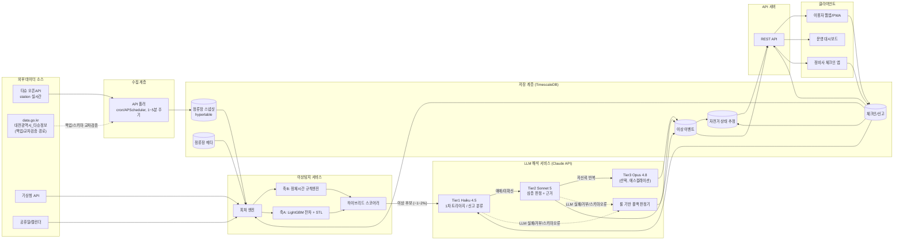

# 3부. 개발

> **문서 상태: 보존된 초안.** 현재 아키텍처·보안·API 기준은 [`docs/v2/03_ARCHITECTURE_SECURITY.md`](../v2/03_ARCHITECTURE_SECURITY.md)와 `docs/v2/contracts/`다.

## 0. 설계 전제와 제약

기술 설계에 들어가기 전에, 리서치에서 확인된 제약 조건을 먼저 명시한다. 이 제약들이 아래 아키텍처·데이터모델·API 설계 전반의 근거가 된다.

| # | 전제 | 근거 | 설계에 미치는 영향 |
|---|---|---|---|
| 1 | 타슈 실시간 API(`station`)는 **정류장 단위 집계**(`parking_count`)만 제공하며, 개별 자전거 ID·고장 여부 필드는 존재하지 않는다 | [R1, 확인] | 시계열 파이프라인은 "고장 확정"이 아니라 "의심 스코어"만 산출 가능 → 체크인(신고/정비) 시스템이 구조적으로 필수 |
| 2 | 거치대 총 용량(`capacity`, 도크 수) 필드가 직접 API 어디에도 없다 | [R1, 확인] | `occupancy_rate` 계산에 필요한 분모를 확보할 수 없음 → 관측 최댓값 기반 추정치로 대체(아래 4장) |
| 3 | data.go.kr `대전광역시_타슈정보`(15109253) 카탈로그 설명에는 "거치대 수" 필드가 있다고 되어 있어 R1의 결론과 상충한다 | [R1 vs R3, **검증 필요**] | 토큰 발급 후 두 경로를 모두 실제 호출해 스키마를 재검증하고, 만약 이 경로에 capacity 필드가 실재하면 1차 소스로 전환 |
| 4 | 개별 자전거번호는 시스템 내부에 존재하나(연 1회 대여이력 CSV), 실시간 API로는 노출되지 않는다 | [R1, 확인] | `bike_state_estimate`는 실시간 파이프라인이 아니라 체크인(신고 시 QR/번호 입력, 정비사 체크인)이 주된 갱신 소스 |
| 5 | 토큰 발급은 수동 승인, 소요기간·호출한도 수치 비공개 | [R1, 확인(문구)/미확인(수치)] | 승인 지연을 전제로 일정을 짜야 함(8장 M1). data.go.kr 경로를 백업/병행 신청 |
| 6 | 정류장 규모는 약 1,000여 개소(2026년까지 1,500개소 확대 발표), 자전거 약 5,000~5,500대 | [R3, 확인 — 언론보도] | 이후 비용·인프라 산정은 이 수치를 기준으로 하고, R4의 LLM 비용 추정(300개소 가정)은 이 규모로 재환산해 사용 |
| 7 | station 합계 데이터만으로 도출 가능한 이상신호(정체재고, 만차-무회전 등)는 전부 "의심(suspect)" 등급이며 확정 판정에는 부적합 | [R2/R3, 확인] | 하이브리드 스코어(자동탐지)는 항상 사람 확인(이용자 신고 또는 정비사 체크인) 경로로 승격되어야만 `confirmed`에 도달 |

---

## 1. 시스템 아키텍처



핵심 설계 포인트:
- **체크인(CHECKIN)이 이상탐지(FEATURE/TIER1)로 역류하는 화살표**가 있다는 점이 이 아키텍처의 핵심이다. 자동탐지가 후보를 좁히고(리콜), 이용자 신고가 즉시성을 더하고(커버리지), 정비사 체크인이 최종 확정(정확도)하는 3단 구조를[R2] 데이터 흐름으로 구현한 것.
- `data.go.kr` 경로는 상시 이중화가 아니라 **①스키마 재검증, ②토큰 승인 지연 시 임시 대체**용 백업으로만 연결한다 — 두 경로가 동일 데이터인지 [불명, R1]이므로 상시 병행 수집은 데이터 정합성 리스크가 있다.
- LLM 서비스 실패(거부/타임아웃/스키마 검증 실패) 시 `FALLBACK`(룰 기반 판정기)이 항상 대체 경로로 존재 — LLM 가용성이 서비스 전체 가용성의 단일 장애점(SPOF)이 되지 않도록 한다.

---

## 2. 기술 스택 확정안

| 구성 요소 | 확정 | 대안 | 선택 근거 |
|---|---|---|---|
| 시계열 저장소 | **TimescaleDB**(PostgreSQL 확장) | InfluxDB | 정류장 메타·체크인 라벨·날씨를 SQL JOIN으로 다뤄야 하는 요구가 핵심이며, 이 프로젝트 볼륨(하루 최대 ~200만 행)에서는 InfluxDB의 순수 쓰기 성능 우위가 체감되지 않음 [R3] |
| 베이스라인 이상탐지 | **STL 분해(statsmodels) + 로버스트 잔차 z-score** | SARIMA | 해석가능성 우선, 정류장/클러스터 단위로 빠르게 배치 적용 가능 [R3] |
| 메인 예측모델(축A) | **LightGBM 잔차 회귀**(전 정류장 pooled 글로벌 모델) | Prophet(클러스터 단위) | 콜드스타트·계절성·비용·해석가능성의 균형이 가장 좋고, station ID를 카테고리 피처로 넣어 신규 정류장도 즉시 추론 가능 [R3] |
| 정체탐지(축B) | 정류장·시간대별 **적응형 percentile 규칙엔진** | PyOD IsolationForest(전역 비지도 모델) | 규칙엔진은 완전 투명하며 콜드스타트 시 즉시 가동 가능. IsolationForest는 2단계 보강 후보로 유보 |
| 실시간 보조 레이어 | **river**(`HalfSpaceTrees` + `ADWIN`) | 생략(배치 재학습만 운영) | 배치 재학습 사이의 급변(예: 정류장 대량 확장 시점)을 온라인으로 조기 포착 [R3] |
| 실험/파이프라인 프레임워크 | **darts**(unit8co) | 자체 statsmodels+lightgbm 직접 조합 | STL/SARIMA/LightGBM을 동일 인터페이스로 교체·비교 가능, `darts.ad`로 스코어러-탐지기-집계기 표준화 [R3] |
| 스케줄러 | cron + APScheduler(초기) → **Airflow**(성숙 후) | Prefect | 정류장 ~1,000개 규모에서 초기부터 Airflow는 과설계 [R3] |
| LLM | **Claude Haiku 4.5**(Tier1) / **Sonnet 5**(Tier2) / Opus 4.8(Tier3, 선택) | 자체 룰 기반만 사용(LLM 레이어 생략) | 3단 티어링이 비용·품질 균형에서 최적 [R4]. LLM 미사용 대안은 예산 제약이 극심할 때의 축소판으로만 고려 |
| 메시지 브로커 | Postgres `LISTEN/NOTIFY` 또는 Redis Streams(경량) | Kafka | 초당 수십~수백 행 수준의 처리량에서 Kafka는 과설계 — R3의 인프라 규모 판단과 동일 논리 적용 |
| API 서버 | FastAPI(Python) | Node.js/NestJS | ML 파이프라인(LightGBM/darts/river)과 동일 런타임(Python)으로 모델 서빙 통합이 용이 |
| 클라이언트 | React 기반 PWA(이용자), 별도 대시보드(운영자) | Next.js SSR | 정류장 상태 조회 중심의 클라이언트-사이드 앱이면 충분, SEO 요구 낮음 |
| 컨테이너 | Docker Compose(초기) → Kubernetes(확장기) | Nomad | 8장 마일스톤 규모에서 Compose로 충분히 시작 가능 |

---

## 3. 데이터 모델 (DDL 초안)

TimescaleDB(PostgreSQL) 기준. 모든 시각 컬럼은 `timestamptz`, ID는 `uuid`(신고/이벤트) 또는 API 원본 문자열 ID(정류장)를 그대로 사용한다.

```sql
-- ============================================================
-- 1. 정류장 메타 (station_meta)
-- ============================================================
CREATE TABLE station_meta (
    station_id          text PRIMARY KEY,        -- 타슈 API의 id (예: 'ST0003')
    name                 text NOT NULL,
    name_en              text,                    -- API 명세상 존재[추정, R1] — 실사용 시 null 허용
    address               text,
    lat                   numeric(9,6) NOT NULL,   -- API의 x_pos (실제 위도)
    lon                   numeric(9,6) NOT NULL,   -- API의 y_pos (실제 경도)
    -- capacity(거치대 수)는 API에 필드가 없음[R1, 확인]. 관측 기반 추정치로 대체.
    capacity_estimated    integer,                 -- rolling max(parking_count) 휴리스틱
    capacity_source       text NOT NULL DEFAULT 'estimated'
                           CHECK (capacity_source IN ('api', 'datago_api', 'estimated', 'manual_survey')),
    launched_at           date,                    -- 콜드스타트 판단용 (days_since_launch 피처)
    is_active             boolean NOT NULL DEFAULT true,
    created_at            timestamptz NOT NULL DEFAULT now(),
    updated_at            timestamptz NOT NULL DEFAULT now()
);

-- ============================================================
-- 2. 정류장 스냅샷 (station_snapshot) — hypertable
-- ============================================================
CREATE TABLE station_snapshot (
    time                  timestamptz NOT NULL,
    station_id            text NOT NULL REFERENCES station_meta(station_id),
    bikes_available        integer NOT NULL,        -- API의 parking_count 원값
    -- 파생 피처는 원칙적으로 별도 continuous aggregate/피처 스토어에서 계산하지만
    -- 감사·재현성을 위해 원본 응답은 그대로 보존한다.
    is_missing             boolean NOT NULL DEFAULT false,  -- 폴링 실패/타임아웃 시 true
    http_status            integer,
    raw_response           jsonb,                    -- 원본 응답 그대로 (스키마 변경 대비 감사 로그)
    PRIMARY KEY (station_id, time)
);
SELECT create_hypertable('station_snapshot', 'time');
CREATE INDEX ON station_snapshot (station_id, time DESC);

-- 예시: 1시간 단위 continuous aggregate (피처 엔진에서 롤링 통계 계산에 활용)
CREATE MATERIALIZED VIEW station_snapshot_hourly
WITH (timescaledb.continuous) AS
SELECT station_id,
       time_bucket('1 hour', time) AS bucket,
       avg(bikes_available)         AS avg_bikes,
       min(bikes_available)         AS min_bikes,
       max(bikes_available)         AS max_bikes,
       count(*) FILTER (WHERE is_missing) AS missing_count
FROM station_snapshot
GROUP BY station_id, bucket;

-- ============================================================
-- 3. 이상 이벤트 (anomaly_event)
-- ============================================================
CREATE TYPE anomaly_status AS ENUM (
    'ai_flagged',      -- 하이브리드 스코어 임계치 초과 (1차 자동탐지)
    'pending_review',  -- LLM/사람 판정 대기
    'suspected',        -- 교차검증 진행 중 (LLM verdict=고장_의심 또는 신고 N건 누적)
    'confirmed',         -- 정비사 체크인 일치 또는 반복신고 임계 초과로 확정
    'dismissed',          -- 오탐/오신고로 기각
    'auto_cleared',        -- 정상 순환 재개 관측으로 자동 해제
    'resolved'               -- 수리 완료 체크인으로 종결
);

CREATE TABLE anomaly_event (
    id                     uuid PRIMARY KEY DEFAULT gen_random_uuid(),
    station_id              text NOT NULL REFERENCES station_meta(station_id),
    detected_at              timestamptz NOT NULL,
    window_start             timestamptz NOT NULL,
    window_end                timestamptz NOT NULL,

    -- 축A/축B/하이브리드 스코어 (3장 시계열 파이프라인 산출값, R3 §3)
    axis_a_zscore              numeric,             -- 잔차 로버스트 z-score
    axis_b_stagnation_ratio    numeric,             -- 정체시간 실제/임계값 비율
    neighbor_divergence_score  numeric,             -- 인접 정류장 대비 국지성 점수
    data_quality_penalty       numeric,
    hybrid_confidence          numeric NOT NULL,     -- 0~1, 결합 스코어

    status                     anomaly_status NOT NULL DEFAULT 'ai_flagged',

    -- LLM 해석 결과 (R4 §3.2 스키마 매핑)
    llm_verdict                text CHECK (llm_verdict IN ('고장_의심','정상_변동','보류')),
    llm_confidence              text CHECK (llm_confidence IN ('낮음','중간','높음')),
    llm_suspected_cause          text,
    llm_reasoning                 text,
    llm_recommended_action        text,
    llm_referenced_fields          jsonb,            -- 환각 검증용 (R4 §4-2)
    llm_model_id                    text,
    llm_request_id                    text,
    llm_raw_response                   jsonb,          -- 재현성/회귀테스트용 원본 보존 (R4 §4-6)

    operator_feedback                  text CHECK (operator_feedback IN ('정탐','오탐', NULL)),  -- human-in-the-loop
    created_at                          timestamptz NOT NULL DEFAULT now(),
    updated_at                          timestamptz NOT NULL DEFAULT now()
);
CREATE INDEX ON anomaly_event (station_id, detected_at DESC);
CREATE INDEX ON anomaly_event (status);

-- ============================================================
-- 4. 체크인/신고 (checkin_report) — 이용자 신고 + 정비사 체크인 통합
-- ============================================================
CREATE TYPE checkin_type AS ENUM ('user_report', 'mechanic_checkin');
CREATE TYPE checkin_status AS ENUM ('pending', 'verified', 'dismissed', 'resolved');

CREATE TABLE checkin_report (
    id                       uuid PRIMARY KEY DEFAULT gen_random_uuid(),
    type                      checkin_type NOT NULL,
    station_id                 text NOT NULL REFERENCES station_meta(station_id),
    bike_id                     text,               -- 사용자 입력/QR 스캔, 검증 안 된 자기신고 값일 수 있음
    reporter_device_id           text,               -- 익명 기기 지문 (중복신고 억제용, R2 §3-a)
    reported_at                   timestamptz NOT NULL DEFAULT now(),

    -- 이용자 신고 전용 필드
    fault_category_raw             text,             -- 사용자가 선택한 원문 카테고리
    description                     text,
    photo_url                        text,
    llm_fault_category                 text,          -- Tier1 Haiku 분류 결과 (R4 §3.4)
    llm_urgency                          text CHECK (llm_urgency IN ('낮음','보통','긴급')),
    llm_station_id_mentioned              text,        -- 신고문에서 언급된 정류장 (LLM 추출, null 허용)

    -- 정비사 체크인 전용 필드
    mechanic_id                            text,
    mechanic_gps_lat                        numeric(9,6),
    mechanic_gps_lon                        numeric(9,6),
    mechanic_action                          text CHECK (mechanic_action IN
                                              ('returned_to_service','withdrawn','parts_pending', NULL)),
    mechanic_notes                            text,

    status                                   checkin_status NOT NULL DEFAULT 'pending',
    linked_anomaly_event_id                   uuid REFERENCES anomaly_event(id),
    resolved_at                                timestamptz,
    created_at                                  timestamptz NOT NULL DEFAULT now()
);
CREATE INDEX ON checkin_report (station_id, reported_at DESC);
CREATE INDEX ON checkin_report (bike_id) WHERE bike_id IS NOT NULL;
CREATE INDEX ON checkin_report (linked_anomaly_event_id);

-- ============================================================
-- 5. 자전거 상태 추정 (bike_state_estimate)
-- ============================================================
-- 주의: 실시간 API에는 개별 자전거 필드가 없으므로[R1, 확인] 이 테이블은
-- station_snapshot이 아니라 checkin_report/anomaly_event에서 갱신되는
-- "best-effort 추정" 테이블이다. bike_id가 없으면 정류장 단위 근사로 취급한다.
CREATE TYPE bike_status AS ENUM (
    'normal', 'suspected_fault', 'confirmed_fault', 'under_repair', 'unknown'
);

CREATE TABLE bike_state_estimate (
    id                       uuid PRIMARY KEY DEFAULT gen_random_uuid(),
    bike_id                   text,                -- null이면 정류장 단위 추정(신뢰도 낮음)
    station_id                 text NOT NULL REFERENCES station_meta(station_id),  -- 마지막 확인 위치
    estimated_status             bike_status NOT NULL DEFAULT 'unknown',
    confidence                    text NOT NULL CHECK (confidence IN ('low','medium','high')),
    last_confirmed_at               timestamptz,
    last_confirmed_by                 text CHECK (last_confirmed_by IN
                                       ('mechanic_checkin','user_report_corroborated','system_inference')),
    source_checkin_id                  uuid REFERENCES checkin_report(id),
    source_anomaly_event_id              uuid REFERENCES anomaly_event(id),
    created_at                            timestamptz NOT NULL DEFAULT now(),
    updated_at                            timestamptz NOT NULL DEFAULT now()
);
CREATE INDEX ON bike_state_estimate (bike_id) WHERE bike_id IS NOT NULL;
CREATE INDEX ON bike_state_estimate (station_id, estimated_status);
```

설계 메모:
- `capacity_source` 필드를 둔 이유는 §0의 "검증 필요" 항목(2, 3) 때문이다. 토큰 발급 후 재검증에서 API가 실제로 capacity를 제공하면 `capacity_source='api'`로 전환, 아니면 `'estimated'`(관측 최댓값)를 계속 쓴다.
- `bike_state_estimate`는 시계열 파이프라인의 직접 산출물이 아니라 체크인 경로의 부산물이라는 점을 스키마 주석으로 명시했다 — 이는 R1이 확인한 "개별 자전거 추적 불가"라는 근본 제약을 데이터 모델에 정직하게 반영한 것이다.

---

## 4. 시계열 파이프라인 상세

### 4.1 폴링
- 주기: **5분**을 기본값으로 시작(R1에서 호출 한도 수치가 비공개이므로 보수적으로 시작), 승인 후 실제 rate limit을 확인하면 1분까지 단축 검토.
- 정류장 1,000~1,500개 규모에서 5분 주기면 하루 28.8만~43.2만 행 — TimescaleDB 단일 인스턴스로 충분 [R3].
- 실패 처리: HTTP 4xx/5xx·타임아웃 시 backoff 재시도, 최종 실패 시 `is_missing=true`로 gap을 명시(장애를 고장으로 오판하지 않기 위한 최소 장치, R3 §2).
- `api-token` 만료/재발급 대응 로직 필수.

### 4.2 피처 계산 (R3 §2 반영)
정류장별 시계열에서 매 폴링 시점마다 아래를 계산한다.
- `occupancy_rate = bikes_available / capacity_estimated` (capacity 미확정 정류장은 별도 플래그)
- `delta_t`, `pct_change_t` (재고 변화량/변화율)
- 15/30/60분 롤링 이동평균·표준편차·기울기
- `turnover_proxy = Σ|delta_t| / 2` — 실제 이동량의 하한선(개별 ID 부재로 인한 과소추정 한계를 명시적으로 인지)
- `stagnation_minutes` — 마지막 재고 변동 이후 경과 시간 (축B의 핵심 피처)
- 인접 정류장(반경 500m~1km) 대비 z-score — "도시 전체가 조용한 새벽"과 "이 정류장만 멈춤"을 구분
- `hour`(sin/cos), `dow`, `is_weekend`, `is_holiday`, `is_rush_hour`
- 날씨(기상청 API, 강수량/기온/풍속) 외생변수 조인
- `is_missing`, gap 길이 (API 장애 vs 정류장 고장 구분용)

### 4.3 학습/추론 주기
- **실시간 추론**: 매 폴링마다 사전 학습된 LightGBM(축A) + 정체시간 규칙(축B)을 즉시 계산, O(ms) 수준.
- **배치 재학습**: LightGBM은 일 단위(새벽), STL 계절성분은 주 단위, 정체시간 적응형 percentile 임계값도 주 단위 갱신.
- **드리프트 감지**: PSI/KS-test로 입력 분포 드리프트 모니터링, 잔차 분포 이동 시(계절 전환, 정류장 1,000→1,500 확장 시점 등) 강제 재학습 트리거. 배치 사이 공백은 river `ADWIN`으로 보완.

### 4.4 콜드스타트 전략 (초기 2~4주)

| 주차 | 단계 | 활동 | 판정 신뢰도 |
|---|---|---|---|
| 1주차 | 수집 전용(Phase 0) | 모델 없이 raw 데이터만 적재, STL/LightGBM 학습용 데이터 축적. 체크인 API는 이 시점부터 이미 오픈(이용자 신고는 데이터 축적과 무관하게 1일차부터 가능) | 자동탐지 없음, 체크인만 가동 |
| 1~2주차 | 전역 규칙 + 비지도 브리지 | 정류장별 percentile 대신 **전역/클러스터 단위** 임계값으로 축B 가동. 필요 시 PyOD `IsolationForest` 같은 전역 비지도 모델(라벨 불필요, 즉시 학습 가능)을 임시 브리지로 병행 | 낮음 — 대시보드 관찰 목록에만 노출, 알람 미발송 |
| 2~3주차 | LightGBM pooled 모델 초기 학습 | LightGBM은 정류장별이 아니라 **전 정류장 pooled 글로벌 모델**이라 개별 STL/SARIMA보다 콜드스타트가 짧다 [R3] — 1~2주 데이터로 초기 적합 가능 | 중간 |
| 3~4주차 | 정류장별 임계값 전환 + 약라벨 결합 | 정류장·시간대별 정체시간 percentile을 실측 데이터로 교체. 누적된 체크인 신고를 약라벨(weak label)로 Precision@k 최초 측정 시작 | 중간~높음, 하이브리드 스코어 정식 가동 |

콜드스타트 기간 동안은 하이브리드 스코어 결합 가중치(R3 §3, `w1~w4`)를 축A(모델 신뢰도 낮음) 비중은 낮게, 체크인 경로(사람 확인) 의존도는 상대적으로 높게 시작하고, 데이터가 쌓이면서 점진 재조정한다.

---

## 5. LLM 통합 상세 (R4 기반)

### 5.1 호출 시점
LLM은 하이브리드 스코어러가 **이상 후보로 승격한 신호에 한해서만** 호출된다(전체 폴링의 약 1~2%로 추정 [R4, 추정]). 86,400~432,000회/일에 달하는 원천 폴링 전량을 LLM에 보내지 않는 것이 비용 설계의 핵심 전제다 — 필터링 없이 전량을 Haiku 트리아지에 보낼 경우 정류장 1,000개 규모에서 월 비용이 하이브리드 설계 대비 30~50배로 뛴다는 것이 R4의 반례 계산으로 확인됨.

### 5.2 JSON 스키마 강제
- `output_config.format`(constrained decoding)으로 응답 전체를 스키마에 강제 — 프롬프트 지시가 아니라 문법 수준 보장 [R4, 확인].
- 스키마 제약상 숫자 range(`minimum`/`maximum`)는 지원되지 않으므로, `confidence`는 숫자가 아니라 `enum(낮음/중간/높음)`으로 설계 — 이는 신뢰도 표기의 편의가 아니라 **API 제약에서 역산된 설계 결정**이다.
- 판정 스키마 핵심 필드: `station_id`(입력값 그대로 반환, 사후 대조 검증용), `verdict`(고장_의심/정상_변동/보류), `confidence`, `suspected_cause`, `reasoning`, `recommended_action`, `referenced_fields`(근거로 인용한 입력 필드명 배열 — 환각 검증용).

### 5.3 프롬프트 캐싱
- 렌더 순서 `tools → system → messages`를 활용해 판정 기준·스키마·few-shot이 담긴 시스템 프롬프트를 고정 앞부분에 두고 `cache_control: ephemeral` 적용.
- 캐시 히트는 기본 입력가의 0.1배 — 하루 수백~수천 건이 동일 시스템 프롬프트를 공유하는 이 워크로드에 특히 유리 [R4, 확인].
- 시스템 프롬프트/도구 목록은 하루 중 고정, 변경은 배치 사이(예: 매일 자정)에만 반영해 캐시 무효화를 최소화.

### 5.4 모델 티어

| 티어 | 모델 | 대상 작업 | 실행 방식 |
|---|---|---|---|
| Tier 1 | Claude Haiku 4.5 | 이상 신호 1차 트리아지, 사용자 신고 텍스트 고장유형 분류 | 실시간 Messages API, `strict` 스키마, thinking off |
| Tier 2 | Claude Sonnet 5 | 고장 의심 판정 + 근거 설명 + 권장조치, 일일 운영 브리핑 | 실시간(판정) / Batch API(브리핑 하위 요약 단계) |
| Tier 3(선택) | Claude Opus 4.8 | Tier 2 저신뢰 반복 건, 현장 출동 직전 최종 확인 | 온디맨드, 상시 운용 아님 |

일일 브리핑처럼 실시간성이 없는 대량 병렬 작업(그날 이상 정류장 각각의 미니 요약)은 **Batch API**(입출력 모두 50% 할인)로 돌려 비용을 절반으로 낮춘다 [R4].

### 5.5 폴백 (LLM 실패 시)
아래 조건 중 하나라도 해당하면 LLM 호출 이전 또는 응답 검증 단계에서 **애플리케이션이 직접** `보류` 또는 룰 기반 기본 판정으로 확정하고, 사람 확인 큐로 넘긴다 — LLM 가용성이 서비스 중단으로 이어지지 않도록 하는 안전장치다.
- `stop_reason != end_turn`(안전 거부, `max_tokens` 도달 등)
- JSON 스키마 검증 실패, 또는 `referenced_fields`가 실제 입력에 없는 필드를 참조(환각 신호)
- API 타임아웃/5xx
- `anomaly_score`가 임계값 ±10% 이내 경계값(애초에 LLM 판정권을 주지 않고 보류로 확정)
- 동일 정류장에 대해 최근 24시간 내 판정이 3회 이상 뒤집힌 이력(진동 신호)

폴백 시에도 축B(정체시간)가 극단값이면 LLM 가용 여부와 무관하게 `pending_review`로 대시보드에 노출되도록 해, LLM 장애가 곧 "위험 신호를 놓치는 것"으로 이어지지 않게 한다.

### 5.6 비용 추정
R4는 정류장 300개·5분 폴링을 전제로 일일 **$2.4~$4.9**(월 $72~147)를 산출했다. 그러나 §0에서 확인했듯 실제 규모는 1,000~1,500개소이므로 [R4의 추정치는 그대로 쓰지 않고] 동일한 단가·비율을 정류장 수 비례로 재환산한다.

| 규모 | 이상 후보(1~2%)/일 | Tier1 비용/일 | Tier2 비용/일(후보의 15%) | 합계(브리핑 포함)/일 | 월 환산 |
|---|---|---|---|---|---|
| 300개소(R4 원 추정) | 864~1,728건 | $1.34~$2.68 | $1.04~$2.08 | $2.4~$4.9 | $72~147 |
| 1,000개소 | 2,880~5,760건 | $4.46~$8.93 | $3.46~$6.91 | **약 $8~16** | **약 $240~480** |
| 1,500개소 | 4,320~8,640건 | $6.70~$13.39 | $5.18~$10.37 | **약 $12~24** | **약 $360~720** |

**[추정 — R4의 300개소 단가를 정류장 수 비례로 재환산한 값이며, 이상 후보 비율(1~2%)·에스컬레이션 비율(15%) 자체가 R4에서 실측 근거 없이 설정한 가정치임을 재확인. 검증 필요.]** 정류장 수가 늘어도 산식이 선형 스케일하므로 3,000개소로 확장돼도 월 $1,000 미만 수준일 것으로 예상되나[R4, 추정], 이 역시 실측 후 재보정 대상이다.

---

## 6. 체크인 API 설계

### 6.1 엔드포인트

| Method | Path | 설명 | 인증 |
|---|---|---|---|
| `POST` | `/api/v1/reports` | 이용자 고장/이용불가 신고 생성 (`station_id`, `bike_id?`, `description`, `photo?`, `device_id`) | 익명 허용(기기 지문으로 중복 억제) |
| `GET` | `/api/v1/reports/{id}` | 신고 상세 조회 | 공개 |
| `GET` | `/api/v1/stations/{station_id}/reports` | 정류장별 신고 이력 | 공개 |
| `GET` | `/api/v1/stations/{station_id}/status` | 정류장 현재 상태 — 공식 `bikes_available` + 우리 시스템의 `hybrid_confidence`/`verdict` 오버레이 | 공개 |
| `POST` | `/api/v1/mechanic/checkins` | 정비사 현장 도착 체크인(GPS, `station_id`, `mechanic_id`) | 정비사 인증(운영기관 제휴 성사 시, §0-5 참조) |
| `POST` | `/api/v1/mechanic/checkins/{id}/inspections` | 개별 자전거 점검 결과 기록(`bike_id`, 상태, 조치) | 정비사 인증 |
| `PATCH` | `/api/v1/mechanic/checkins/{id}/complete` | 체크인 완료 처리 | 정비사 인증 |
| `GET` | `/api/v1/anomaly-events?status=&station_id=` | 대시보드용 이상 이벤트 목록 | 운영자 인증 |
| `POST` | `/api/v1/anomaly-events/{id}/feedback` | 운영자 정탐/오탐 피드백(human-in-the-loop 라벨 축적, R3 §5) | 운영자 인증 |
| `GET` | `/api/v1/bikes/{bike_id}/status` | 자전거 단위 상태 조회(best-effort, `bike_id` 있는 신고/이력에 한함) | 공개 |
| `GET` | `/api/v1/briefings/daily?date=` | 일일 운영 브리핑 조회 | 운영자 인증 |

- 신고 생성은 반드시 `device_id` 기반 짧은 시간창 내 중복 억제 로직을 거친다(동일 대상에 대한 악의적 대량신고 방지, R2 §3-a 한계 대응).
- `bike_id`는 사용자가 QR/수동 입력한 자기신고 값으로, 검증되지 않은 필드임을 API 문서에 명시(§0-4의 제약을 그대로 반영).

### 6.2 상태 전이 규칙

`anomaly_event.status`와 `checkin_report.status`를 하나의 논리적 라이프사이클로 통합해 운영한다(R2 §3의 세 체크인 유형을 R3 §3의 축A/B 스코어와 결합):

| 상태 | 진입 조건 | 트리거 | 다음 상태 |
|---|---|---|---|
| `ai_flagged` | 하이브리드 스코어 ≥ 임계치 | 시계열 파이프라인(§4) | `pending_review` |
| `pending_review` | ai_flagged 승격 직후 | LLM Tier1/2 호출 시작 | `suspected` \| `dismissed`(LLM verdict=정상_변동, 고신뢰) |
| `suspected` | LLM verdict=고장_의심 **또는** 독립 이용자 신고 N건(중복 배제) 누적 | 이용자 신고 API, LLM 판정 | `confirmed` \| `dismissed`(반박 신고 우세) |
| `confirmed` | 정비사 체크인이 신고와 일치 **또는** 반복 신고 임계 초과 | `POST /mechanic/checkins/.../inspections` | `resolved` |
| `dismissed` | 오신고/오탐으로 판정 | 운영자 피드백 또는 반증 신고 | (`normal`, 이벤트 종결) |
| `auto_cleared` | 별도 조치 없이 정상 순환 재개 관측(연속 N회 정상 회전) | 시계열 파이프라인 자동 재평가 | (`normal`, 이벤트 종결) |
| `resolved` | 정비사 조치 완료 체크인 | `PATCH /mechanic/checkins/{id}/complete` | (`normal`, 이벤트 종결) |

`confirmed`로의 승격은 **LLM 단독 판정만으로는 발생하지 않는다** — 반드시 이용자 신고 누적 또는 정비사 체크인과의 교차검증을 거친다. 이는 §0-7에서 확인한 "station 합계 데이터로는 확정 판정 불가"라는 제약을 상태 머신 레벨에서 강제하는 장치다. 정비사 체크인 경로(`mechanic_checkin`)는 운영기관 제휴가 성사되지 않으면 구현 자체가 불가능하므로[R2 §3-b], 제휴 이전 단계에서는 `confirmed`가 "반복 신고 임계 초과"로만 도달 가능하도록 설계한다.

---

## 7. 배포·운영

### 7.1 컨테이너 구성
Docker Compose로 시작(§2 근거):

```
services:
  poller           # 타슈 API 폴러 (§4.1)
  feature-worker    # 피처 엔진 + 축A/B 스코어러 (§4.2~4.3)
  llm-service         # Tier1/2/3 호출 + 폴백 로직 (§5)
  api-server            # FastAPI REST 서버 (§6)
  webapp                  # 이용자 PWA (nginx 서빙)
  dashboard                 # 운영 대시보드
  timescaledb                 # 시계열 저장소
  redis(선택)                    # 캐시 / feature-worker↔llm-service 간 경량 큐
```

트래픽·정류장 규모가 커지면 `feature-worker`/`llm-service`를 Kubernetes로 개별 스케일링하되, M1~M3 단계에서는 Compose 단일 호스트로 충분하다(§2).

### 7.2 모니터링
- **파이프라인 헬스**: 폴러 성공률, `is_missing` gap 비율, API 4xx/5xx(토큰 만료 조기 경보)
- **모델 드리프트**: PSI/KS-test 대시보드, river `ADWIN` 알람(§4.3)
- **LLM 운영 지표**: `usage.cache_read_input_tokens`(캐시 히트율 — 0으로 떨어지면 시스템 프롬프트에 비결정적 요소 혼입 의심, R4 §1.2), `stop_reason` 분포, 스키마 검증 실패율, `referenced_fields` 불일치율(환각 지표, §5.5와 연동)
- **비즈니스 지표**(R3 §5): Precision@k, Recall@신고건수, Lead time(알람 시각 대비 신고 접수 시각), 알람량/일(alert budget)
- **비용 추적**: Anthropic API 실사용 토큰 vs §5.6 예산 대비 실시간 대조

### 7.3 비용 추정 (요약)
- LLM 비용: §5.6 참조 — 정류장 1,000~1,500개 규모에서 **월 약 $240~720[추정, 재환산치]**.
- 인프라 비용(TimescaleDB 호스팅, 소형 VM, Redis 등): 이 리서치 범위에서 직접 조사되지 않음 — **검증 필요**(클라우드 사업자·인스턴스 사양 확정 후 별도 산정).

---

## 8. 구현 순서 (M1~M4)

각 마일스톤은 이전 단계 DoD 충족을 전제로 순차 진행하되, M2의 체크인 MVP는 M1과 최대한 병행해 초기부터 신고 데이터(약라벨)를 쌓기 시작한다.

### M0 (선행, M1과 병행) — API 토큰 신청
- 타슈 앱 내 OpenAPI 신청 + data.go.kr `대전광역시_타슈정보` 병행 신청(백업 경로, §0-5).
- **리스크**: 수동 승인, 소요기간 비공개[R1] — 일정 지연 가능성을 M1 착수 조건에 명시하고, 승인 전까지는 2020년 위치현황 CSV 등 정적 데이터로 스키마·좌표 검증만 선행.

### M1 — 수집기 + DB
- API 폴러 구현(§4.1), `station_meta`/`station_snapshot` 스키마 마이그레이션, `is_missing` 플래그, idempotent upsert.
- 토큰 발급 후 실제 응답 스키마 재검증 — 특히 `capacity`/거치대 필드 존재 여부(§0-3의 상충 해소).
- **DoD**: 2주 이상 연속 무중단 수집(gap 비율 사전 정의 기준 이내), `station_meta` 초기 적재(좌표·주소 확인), raw 쿼리로 임의 정류장의 시계열 조회 가능, capacity 필드 존재 여부에 대한 §0-3 결론 확정.

### M2 — 탐지 v1(룰 기반) + 체크인 MVP
- 축B 정체탐지 규칙엔진(전역/클러스터 percentile), 인접 정류장 비교, `anomaly_event` 적재.
- 체크인 API 최소 기능(`POST /reports`, `GET /stations/{id}/status`) 배포 — 이용자 신고를 M1 수집과 무관하게 최대한 빨리 오픈해 약라벨 축적을 시작.
- **DoD**: 룰 기반 알람이 정의된 alert budget 내에서 발생, 신고-알람 최소 매칭 사례 확보(Precision@k 측정 가능한 최소 표본), 체크인 API 실사용 신고 1건 이상 접수 확인.

### M3 — 시계열 모델 + LLM
- LightGBM pooled 잔차모델(§4.3) 학습, STL 백업, 하이브리드 스코어 결합, river 온라인 보조탐지 도입.
- LLM Tier1/Tier2 연동(JSON 스키마 강제, 프롬프트 캐싱, §5), 폴백 로직 구현.
- **DoD**: 신규 모델을 섀도 모드로 최소 2주 룰 기반과 병행 비교(R3 §5.3), Precision@k/Recall/Lead time이 룰 기반 대비 개선 확인, `referenced_fields` 검증·보류 강제조건 등 환각 억제 장치(§5.5) 동작 확인, LLM 강제 장애 테스트에서 폴백 정상 동작 검증.

### M4 — 앱/대시보드
- 이용자 PWA(신고 생성 + 정류장 상태 조회), 운영 대시보드(이상 이벤트 목록, 정탐/오탐 피드백, 일일 브리핑), 정비사 체크인 앱.
- 정비사 체크인 기능은 **운영기관 제휴 성사를 전제**로 하므로[R2 §3-b, §4], 제휴가 M4 시점까지 성사되지 않으면 해당 기능은 별도 마일스톤(M4-b)으로 분리하고, 이용자 신고+시스템 자동탐지 하이브리드만으로 우선 배포한다(R2 §4의 단계적 로드맵 — ①/③ 선행 후 ② 제휴 제안).
- **DoD**: 신고 접수→`suspected`→`confirmed`→`resolved` 전체 상태 전이 E2E 테스트 통과, 대시보드에서 운영자 피드백 루프 완성, 일일 브리핑 자동 생성·배포 확인, (해당 시) 정비사 앱 연동 검증.
