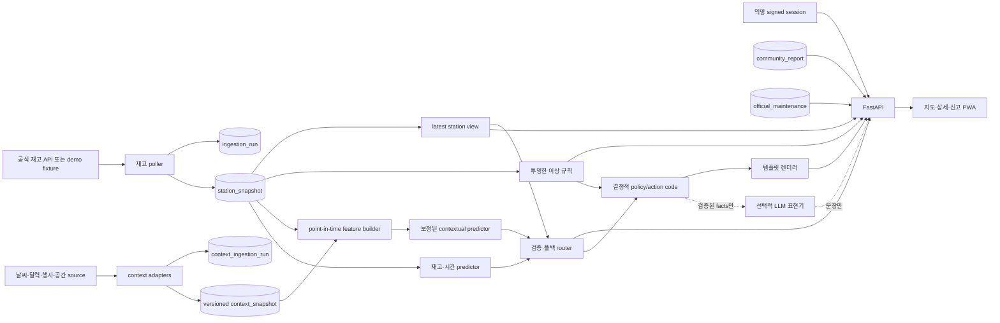

# 03. MVP 아키텍처·보안 기준

> 상태: v2 구현 기준선  
> 범위: 해커톤에서 실제로 끝낼 수 있는 최소 vertical slice와, 공개 배포 전에 반드시 지킬 보안·개인정보·운영 규칙  
> API 계약: [`contracts/openapi.yaml`](./contracts/openapi.yaml)

## 1. 결정 원칙

1. **집계 재고는 고장 확정 데이터가 아니다.** 정류장 재고 정체는 수요 부족, 재배치, API 캐시, 통신 장애, 실제 고장 중 무엇인지 구분하지 못한다. 서비스는 이를 `재고 정체 신호`로만 표시한다.
2. **다섯 상태 축을 합쳐 하나의 진실값으로 만들지 않는다.** 예측, 이상 신호, 커뮤니티 신고, 공식 정비, 데이터 최신성은 출처와 의미가 다르다.
3. **LLM은 표현층이다.** 등급, 상태, 원인, 우선순위, 공식 확인 여부를 결정하거나 DB 상태를 바꿀 권한이 없다.
4. **익명은 무식별·무제한을 뜻하지 않는다.** 하드웨어 지문이나 사용자가 보내는 `device_id` 없이, 서버가 발급한 짧은 수명의 signed session과 신고별 capability token으로 권한과 남용 방지를 구현한다.
5. **오프라인 데모는 운영 모드와 같은 계약을 쓴다.** fixture도 동일 OpenAPI 응답을 반환하며, 최신성은 `fresh/stale/unavailable`, 출처는 별도 `data_source=demo`로 숨김없이 표시한다.

### 비목표

- 개별 자전거 고장 대수나 원인을 집계 API만으로 산출하지 않는다.
- 확인되지 않은 거치대 용량을 이용해 만차·빈 거치대 여부를 확정하지 않는다.
- 커뮤니티 신고 수만으로 `공식 고장 확인` 상태를 만들지 않는다.
- 이용자 추적, 광고 식별, 기기 지문 수집을 하지 않는다.
- MVP에서 사진 업로드, 회원가입, 정비사 업무 시스템을 구현하지 않는다.

## 2. 최소 vertical slice

LLM 경로가 끊겨도 `source → adapter/poller → versioned snapshot → point-in-time feature/predictor 또는 폴백 → policy/template → API → PWA`가 완주하는 것이 최소 성공 조건이다. MVP는 한 프로세스의 FastAPI와 한 PostgreSQL 인스턴스로 시작할 수 있다. poller와 API를 별도 컨테이너로 나누더라도 Kafka, Kubernetes, 범용 feature store는 필요하지 않다. 다만 학습과 서빙이 같은 as-of 규칙을 재현할 수 있는 versioned context snapshot과 feature manifest는 생략하지 않는다.

### 요청 흐름

1. 클라이언트는 `POST /api/v1/sessions/anonymous`로 signed session 쿠키와 CSRF 토큰을 받는다.
2. `GET /api/v1/stations`와 `GET /api/v1/stations/{station_id}/forecast`는 다섯 축을 병렬 필드로 반환한다. 단일 `badge`로 축을 합치지 않는다. 목록은 정류장명·주소 `query`와 선택적 단일 `origin=lat,lon`을 받으며, 원점이 있으면 `walk_minutes`를 계산한다.
3. 서버는 공식 재고의 `data_source`·`data_freshness`를 먼저 판정한 뒤, 맥락 특징을 point-in-time으로 조립한다. 검증된 `contextual_ml`을 우선하고 불완전한 맥락을 0으로 채우지 않은 채 `inventory_temporal`, `current_stock` 순으로 폴백한다. policy가 등급·행동 코드를 결정하며, 대안은 `data_freshness=fresh`인 정류장만 최대 3개 반환하고 각각 공식 재고·출처·기준시각을 포함한다.
4. 선택적으로 LLM이 허용된 facts와 이미 결정된 action code를 자연어로 바꾼다. 시간 초과, 스키마 오류, 예산 초과 시 템플릿을 그대로 반환한다.
5. 신고 생성은 signed session, CSRF, `Idempotency-Key`를 요구한다. 해당 신고의 조회·취소에만 쓸 수 있는 capability token을 한 번 발급하며, 동일 멱등 요청에는 새 token이 아니라 최초 생성 응답을 재생한다.
6. 신고 조회·취소는 세션과 capability token이 모두 일치해야 한다. UUID를 안다는 이유만으로 읽을 수 없다.

`walk_minutes`는 실제 보행 결과가 아니라 서버의 버전 고정 거리/경로 adapter가 계산한 **예상 도보시간**이다. 계산 방법과 버전을 운영 설정·로그에 남기며, 경로 adapter를 검증하지 못한 demo에서는 고정 fixture 값만 사용하고 UI가 정확한 도착시간처럼 표현하지 않는다.

사용자의 `origin`, 검색어, 정밀 이동 위치는 대안 정렬 요청 안에서만 일시적으로 처리한다. 이를 feature builder, model 입력, context snapshot, prediction log에 넣지 않는다. 공간 맥락은 정류장 좌표와 승인된 비식별 공간 셀·POI version만 사용한다.

## 3. 수집 데이터 모델

### 3.1 `ingestion_run`: 호출 한 번의 사실

API 실패를 정류장 재고 행으로 위조하지 않는다. 한 번의 원격 호출 또는 fixture 로딩마다 run 한 건을 기록한다.

| 필드 | 의미 |
|---|---|
| `run_id` | UUID/ULID 기본키 |
| `source` | `data_go_kr`, `direct_api`, `fixture` |
| `mode` | `live`, `demo` |
| `started_at`, `finished_at` | 호출 수명주기 |
| `status` | `started`, `succeeded`, `partial`, `failed` |
| `http_status`, `latency_ms` | 원격 호출 결과. fixture면 null 가능 |
| `source_observed_at` | 원천이 제공한 기준시각. 없으면 null |
| `received_at` | 우리 서버 수신시각 |
| `payload_hash` | 동일·정체 payload 감지용 해시 |
| `item_count`, `valid_count`, `invalid_count` | 파싱 품질 |
| `error_code` | `timeout`, `auth`, `rate_limited`, `schema`, `upstream_5xx` 등 제한 enum |
| `raw_object_key` | 원문을 별도 암호화 저장할 때의 키. 짧은 보존기간 적용 |

외부 API 계약의 `data_source`와 내부 수집 계층 값은 다음처럼 명시적으로 변환한다. 외부 값을 내부 enum으로 그대로 저장하거나 반대로 노출하지 않는다.

| 외부/adapter `data_source` | `ingestion_run.source` | `ingestion_run.mode` |
|---|---|---|
| `live_datago` | `data_go_kr` | `live` |
| `live_direct` | `direct_api` | `live` |
| `demo` | `fixture` | `demo` |

`4xx`를 일괄 재시도하지 않는다. 인증 오류는 즉시 운영 경보, `429`는 `Retry-After`+jitter, 타임아웃·일부 `5xx`만 제한 횟수 재시도한다. TLS 검증은 절대 끄지 않는다.

### 3.2 `station_snapshot`: 실제로 관측한 정류장 행

| 필드 | 의미 |
|---|---|
| `run_id`, `station_id` | 복합 기본키, `ingestion_run` FK |
| `observed_at` | 외부 계약에서 사용하는 관측 기준시각 |
| `collected_at` | 우리 수집기가 응답 또는 fixture를 수집 완료한 시각. run의 `received_at`에서 전달 |
| `observed_at_basis` | `source_observed_at` 또는 `collected_at`. 원천 시각이 없어서 수집시각을 대체 사용했는지 명시 |
| `ingested_at` | 정규화된 snapshot의 DB 적재시각 |
| `bikes_available` | 원천 `parking_count`, 0 이상 |
| `lat`, `lon`, `name` | 정규화된 메타. 좌표 범위 검증 |
| `source_record_hash` | 정류장 행의 반복·변경 감지 |
| `schema_version` | 파서/계약 버전 |

핵심 불변식은 다음과 같다.

- 실패한 run에는 가짜 `bikes_available=0` 또는 이전 값 forward-fill snapshot을 넣지 않는다.
- 부분 성공은 유효한 정류장 행만 저장하고 `ingestion_run.status=partial`로 남긴다.
- 원본 전체 JSON을 정류장마다 복제하지 않는다. raw payload는 run당 한 번만 저장한다.
- 최신 화면은 `latest successful snapshot`과 최근 run 상태를 조합한다. 마지막 성공값과 최신성 상태를 별도 필드로 보여준다.
- 중복 run 재처리는 `(run_id, station_id)` 및 payload hash로 멱등 처리한다.
- `observed_at`이 있으면 `observed_at_basis`도 반드시 있고, basis가 `collected_at`이면 두 시각이 같아야 한다. 성공 관측이 없는 unavailable 상태에서는 `observed_at`, `collected_at`, basis가 모두 null일 수 있다.

### 3.3 `context_ingestion_run`과 versioned `context_snapshot`

날씨·달력·행사·정류장 주변 공간 정보는 공식 재고와 다른 source adapter로 수집한다. 공식 재고의 `data_source`·`data_freshness`에 맥락 상태를 섞지 않으며, adapter별 run과 정규화 snapshot을 별도로 남긴다.

| 필드 | 의미 |
|---|---|
| `context_run_id` | UUID/ULID 기본키 |
| `kind` | `weather`, `calendar`, `event`, `neighbor`, `inventory` 중 adapter 종류 |
| `source`, `source_version` | 공개 제공자/데이터셋과 파서·계약 버전. credential 또는 key 포함 URL 금지 |
| `started_at`, `received_at`, `finished_at` | 우리 수집 수명주기 |
| `status`, `http_status`, `error_code` | 성공·부분·실패와 제한된 오류 코드 |
| `payload_hash`, `item_count`, `invalid_count` | 재현·schema drift·품질 확인 |
| `mode` | `live`, `demo` |

정규화 `context_snapshot`은 최소한 다음을 갖는다.

| 필드 | 의미 |
|---|---|
| `context_snapshot_id`, `context_run_id` | 불변 snapshot ID와 수집 run FK |
| `kind`, `natural_key` | 맥락 종류와 원천 내 version 식별자 |
| `station_id` 또는 `spatial_cell` | 정류장 수준 결합 키. 사용자 원점·검색어 금지 |
| `issued_at` | 예보·일정 version이 원천에서 발행된 시각. 원천이 제공하지 않으면 null |
| `valid_from`, `valid_until` | 해당 맥락이 설명하는 유효 구간 |
| `available_at` | 우리 시스템이 실제로 이 version을 사용할 수 있게 된 시각 |
| `collected_at`, `ingested_at` | 수집·정규화 적재 시각 |
| `source`, `source_version`, `schema_version` | 출처와 변환 계약 |
| `synthetic` | fixture·합성 맥락 여부 |

같은 행사·날씨 예보가 수정돼도 기존 행을 덮어쓰지 않고 새 version으로 append한다. 학습 시점의 발행 내용을 재현할 수 없는 최신본-only 데이터는 contextual feature로 승격하지 않는다. 합성 맥락이 하나라도 feature에 들어가면 공식 재고가 live여도 응답 전체를 `data_source=demo`로 강등하고 실제 이동 추천·운영 성능 집계에서 제외한다.

외부 API key는 서버 측 secret store 또는 배포 환경에서만 주입한다. header와 query 어느 형태든 access log·trace·fixture·오류 메시지·`context_evidence.source`에서 제거하고, credential이 포함된 원문 URL을 저장하지 않는다. source별 이용약관과 재배포·보존 허용 범위도 adapter 승인 게이트에 포함한다.

### 3.4 Point-in-time feature와 prediction provenance

feature builder는 `prediction_at`과 `target_at=prediction_at+15분`을 입력받고 아래 조건을 모두 만족하는 snapshot만 사용한다.

- 재고와 lag/rolling/neighbor 관측은 `observed_at <= prediction_at`이며 미래 방향 nearest join을 금지한다.
- 모든 맥락은 `available_at <= prediction_at`이어야 한다. `issued_at`이 있으면 이 또한 `prediction_at` 이하여야 한다.
- 날씨 예보는 `target_at`을 포함하는 당시 발행 version, 달력·행사는 `target_at`에 유효하다고 당시 알려진 version을 사용한다. 사후 실측 날씨, 실제 관객 수, 최종 취소·변경 상태를 과거 특징으로 주입하지 않는다.
- rolling 계산, 결측 대체, category/정류장 encoding, scaling은 split의 학습 구간에서만 적합한다.
- 사용자 `origin`·검색어·정밀 이동 위치, 커뮤니티 신고·자유 텍스트, 공식 정비 상태는 예측 feature가 아니다.

초기 feature contract는 KST 시각의 주기형 시간·요일, 공식 재고 현재값과 과거 방향 lag/rolling, 당시 발행된 목표시각 날씨 예보, 사전 공지된 공휴일·학사 일정, 당시 알려진 행사 일정·장소·규모 구간, versioned 정류장 공간 셀·POI와 `prediction_at` 이하 인접 재고로 제한한다. 연간 CSV처럼 서빙 시점에 도착하지 않는 최근 대여 이벤트와 사후 확정된 날씨·행사 결과는 온라인 feature로 등록하지 않는다.

`feature_contract_version`은 필드 목록·타입·단위·필수 source·TTL·결측 처리·as-of join 규칙을 묶는다. 계약의 필수 맥락이 모두 fresh하고 point-in-time 조건을 만족할 때만 `context_status=complete`, 일부가 누락·지연이면 `partial`, 검증 가능한 맥락 집합이 없으면 `unavailable`이다. 누락된 강수·행사를 각각 “비 없음”, “행사 없음” 또는 숫자 0으로 만들지 않는다.

각 prediction log는 최소 `prediction_id`, `station_id`, `prediction_at`, `target_at`, 공식 `station_snapshot` ID, 사용한 `context_snapshot_id[]`, `feature_contract_version`, `prediction_basis`, `context_status`, 누락 kind, `model_version`, `calibration_version`, `threshold_version`, 원시 score와 보정 확률, 최종 mode/grade를 기록한다. 사용자 위치와 외부 credential은 기록하지 않는다. 공개 응답의 `context_evidence`는 이 provenance에서 최대 2개의 구조화 사실만 고르며, `direction`은 신호에 대한 연관 방향이지 인과 설명이 아니다.

### 3.5 Predictor routing과 폴백

1. 공식 재고가 fresh하고, `context_status=complete`이며, feature/model/calibration/threshold version이 함께 승인된 경우에만 `prediction_basis=contextual_ml`을 사용한다.
2. 맥락이 `partial|unavailable`이거나 contextual artifact가 미승인·오류이면 결측을 0으로 채우지 않고, fresh 공식 재고의 lag/rolling과 KST 시간 특징만 사용하는 별도 평가·보정 모델 `prediction_basis=inventory_temporal`로 폴백한다. 날씨·달력·행사 특징은 이 모델에 주입하지 않는다.
3. inventory-temporal 모델도 평가 게이트를 통과하지 못했거나 안전하게 실행할 수 없지만 공식 재고는 fresh하면 `mode=current_stock`으로 폴백한다. 이때 `prediction_basis`, `feature_contract_version`, `calibration_version`은 null이다.
4. 공식 snapshot이 없거나 stale/unavailable이고 검증된 trip-history 표본·등급 계약이 있으면 `mode=demand_pressure`, `prediction_basis=historical_demand`로 강등한다. 이는 context evidence가 없는 역사적 수요 기준선이며 현재 재고·재고 소진 확률이 아니다.
5. historical-demand 게이트도 통과하지 못하면 `mode=unavailable`로 강등한다. stale 공식 재고를 contextual 모델이 보정해 fresh처럼 만들 수 없다.

모든 폴백은 동일 요청 안에서 결정적으로 수행하며 사유 코드를 내부 로그에 남긴다. `context_status`는 공식 재고 최신성의 대체값이 아니며, `data_source`·`data_freshness`를 변경하지 않는다. 단, 위에서 정한 합성 맥락 사용은 응답 전체를 명시적 demo로 강등하는 예외다.

## 4. 다섯 상태 축

| 축 | 소유 데이터/산출자 | 허용 의미 | 금지되는 해석 |
|---|---|---|---|
| **예측/결정 신호** | 공식 snapshot, versioned context, point-in-time feature, 보정 모델/폴백 | `decision_signal.mode`, `prediction_basis`, `context_status`에 따른 소진 위험·수요 압력·현재 재고·분석 불가와 유효기간 | 맥락 상태를 공식 재고 최신성으로 사용, 두 grade 방향 혼합, 실제 이용 가능 대수 확정 |
| **재고 정체 신호** | 정체·인접 대비 규칙 | `none/collecting/stagnant/under_review` 정체 후보 | 자전거/거치대 고장 확정 또는 구체 원인 진단 |
| **커뮤니티 신고** | 익명 이용자 category | `none/recent/corroborated/expired`와 최근 활성 신고 건수 | 독립적인 공식 사실, 신고 수만으로 확정 |
| **공식 정비** | 인증된 운영기관 연동만 | `unavailable/unknown/confirmed_fault/under_repair/resolved` | 익명 신고나 LLM이 생성·변경 |
| **최신성** | ingestion run + snapshot | `fresh/stale/unavailable`, 기준시각과 age | `stale`을 재고 정체 신호로 변환 |

API와 UI는 축을 `data_freshness`, `decision_signal`, `inventory_signal`, `community_report_state`, `official_maintenance_state`로 유지한다. 표시 우선순위가 필요하면 공식 정비를 가장 눈에 띄게 할 수 있지만, 다른 축을 덮어쓰거나 이력에서 삭제하지 않는다. 최신 snapshot이 없으면 재고 기반 예측을 수요 압력 신호로 바꾸거나 분석 불가로 표시하며, 마지막 재고를 현재값처럼 내보내지 않는다.

`context_status=complete|partial|unavailable`은 `decision_signal` 안의 예측 provenance이며 여섯 번째 공식 상태 축이나 `data_freshness`의 별칭이 아니다. 공식 재고가 fresh여도 맥락은 partial일 수 있고, 이 경우 contextual 모델이 아니라 검증된 inventory-temporal 모델 또는 현재 재고로 폴백한다.

### `decision_signal` mode와 grade 방향

- `mode=stockout_risk`: 최신 snapshot과 승인된 예측 basis를 사용할 수 있을 때 산출한다. `stockout_probability=0..1`, `stockout_risk_grade=low/medium/high`이며 **high는 대여 가능성이 높다는 뜻이 아니라 소진 위험이 높다는 뜻**이다. 확률은 정확히 t+15 공식 재고가 1대 미만일 확률이고 `demand_pressure_grade`는 null이다.
- `mode=demand_pressure`: snapshot 없이 과거 대여 이력만으로 15분 수요 압력을 표현한다. `demand_pressure_grade=low/medium/high`이고 `stockout_probability`, `stockout_risk_grade`는 null이다. 이는 현재 재고 소진 확률이 아니다.
- `mode=current_stock`: 최신 공식 재고만 안전하게 보여줄 수 있다. `stockout_probability`와 두 grade는 null이다.
- `mode=unavailable`: 판단 자료가 부족하다. `stockout_probability`와 두 grade는 null이다.

OpenAPI oneOf가 `stockout_probability`와 mode별 grade의 잘못된 동시 non-null을 금지한다. grade에는 `unavailable`이라는 네 번째 값을 만들지 않고 분석 불가는 mode로 표현한다.

graded mode는 방향을 명시한다. `stockout_risk`의 `grade_direction=higher_means_higher_stockout_risk`, `demand_pressure`의 `grade_direction=higher_means_higher_demand_pressure`는 고정값이며 둘 다 grade 경계의 `threshold_version`을 함께 반환한다. UI는 이 방향을 뒤집어 “high=대여 가능성 높음”으로 표현해서는 안 된다.

graded mode는 non-null `prediction_basis`와 `feature_contract_version`을 함께 반환한다. `prediction_basis=contextual_ml`이면 `context_status=complete`, non-null `calibration_version`, fresh 외부 맥락 evidence 1~2개를 요구한다. `inventory_temporal`은 fresh 공식 재고 lag/rolling+시간 기반의 검증된 폴백이며 non-null calibration version과 fresh inventory evidence 1~2개만 허용한다. `historical_demand`는 no-snapshot trip fallback으로 `context_status=unavailable`, `calibration_version=null`, `context_evidence=[]`다. `current_stock|unavailable`은 세 모델 provenance를 null로 반환하고 evidence를 빈 배열로 둔다.

최신성과 결정 신호도 독립 축이지만 허용 조합은 제한한다. `fresh`는 `stockout_risk|current_stock`, `stale|unavailable`은 `demand_pressure|unavailable`만 가능하다. `StationState`가 `fresh`이면 `inventory`도 반드시 non-null이다. compatibility schema가 `stale+stockout_risk`, `fresh+inventory:null` 같은 모순 응답을 거부한다. 최대 3개의 대안 후보는 모두 `fresh`이고 `stockout_risk|current_stock`만 사용하며, 주소가 없을 수 있어도 공식 재고·data source·관측 기준시각·예상 도보시간을 반드시 포함한다.

공식 정비 메타데이터는 상태와 함께 검증한다. `unavailable`은 `verified=false`, `updated_at=null`, `source=null`이어야 한다. `unknown|confirmed_fault|under_repair|resolved`는 인증된 공식 소스를 실제로 조회한 상태이므로 `verified=true`와 non-null `updated_at`, `source`를 요구한다. 커뮤니티·LLM·재고 정체 신호가 이 조합을 만들 수 없다.

### 최신성 판정

- `fresh`: 마지막 성공 관측의 age가 설정된 `stale_after_seconds` 이하.
- `stale`: 마지막 성공 관측은 있으나 임계값을 넘음. 마지막 값은 보여줄 수 있지만 의사결정 권고는 보수적으로 제한한다.
- `unavailable`: 성공 관측이 없거나 최대 허용 age를 넘음.
- demo 여부는 최신성 enum이 아니라 독립 `data_source=demo`로 표시한다. fixture도 고정 clock 기준으로 `fresh/stale/unavailable` 중 하나를 가지며 UI 워터마크를 강제한다.

임계값은 배포 설정으로 관리하고 API 응답에 함께 내려 클라이언트가 임의로 추측하지 않게 한다.

`unavailable_after_seconds`는 반드시 `stale_after_seconds`보다 크다. 설정 로딩 시 이 불변식을 검증하고 위반하면 서비스 시작을 실패시킨다.
최신성 age는 API 응답의 `observed_at`으로 계산하되, `observed_at_basis`를 함께 기록·표시해 원천 지연과 우리 수집 지연을 구분한다. 모델 평가와 운영 대시보드는 두 basis를 섞어 하나의 SLA처럼 집계하지 않는다.

### 재고 정체 신호 공개 게이트

규칙 구현 직후에는 `shadow-only`다. 후보는 로그·평가 테이블에만 기록하고 API/UI에는 `inventory_signal=collecting`으로 노출한다. 최소 수집기간, 운영자가 검토한 표본 수, 일일 alert budget, 허용 오탐 기준을 사전에 정하고 평가를 통과한 버전만 `stagnant/under_review`를 사용자에게 노출한다. shadow 신호는 대안 추천·행동 코드·LLM 문장의 근거로도 사용하지 않는다.

## 5. LLM 표현층과 템플릿 폴백

### 허용

- 입력: 서버가 계산·검증한 `fact_key`, 값, 단위, 이미 결정된 `decision_signal.mode`, 승인된 `stockout_probability`와 해당 grade, `prediction_basis`, `context_status`, 최대 2개의 `context_evidence`, `inventory_signal`, `action_code`.
- 출력: 최대 2문장의 설명과 전달 톤. 출력은 구조화 스키마로 검증한다.
- 저장: `source=llm|template`, template/prompt 버전, model ID, 입력 facts hash, 지연, token 사용량.

### 금지

- LLM이 `decision_signal.mode`, `stockout_probability`, `stockout_risk_grade`, `demand_pressure_grade`, `inventory_signal`, `official_maintenance_state`, `action_code`, 신고 상태를 만들거나 변경하는 행위.
- 집계 snapshot에 없는 대여·반납 건수, 고장 부품, 원인, 확률을 추정하는 행위.
- `context_evidence.direction`을 “날씨/행사가 소진을 일으켰다”는 인과 설명으로 바꾸거나 evidence에 없는 맥락을 보충하는 행위.
- 사용자 자유 텍스트를 시스템 지시와 섞거나, LLM이 DB/API 도구를 호출하게 하는 행위.
- LLM 자기평가 confidence를 제품 confidence로 사용하는 행위.

템플릿은 `action_code + fact_key` 조합으로 버전 관리한다. 예: `consider_alternative + mode=stockout_risk + stockout_risk_grade=high`. LLM 호출 예산은 짧은 시간 제한과 일일 비용 상한을 갖고, 오류·거부·429·timeout·schema mismatch면 재판정하지 않고 동일 facts의 템플릿을 반환한다. LLM 장애는 health를 `degraded`로 만들 수는 있어도 station/forecast API를 중단시키지 않는다.

## 6. 익명 보안 모델

### 6.1 Signed session

- 서버가 생성한 고엔트로피 `sid`를 서명된 토큰에 넣고 `HttpOnly; Secure; SameSite=Lax` 쿠키로 발급한다.
- 토큰에는 `sid`, `iat`, `exp`, `aud`, key id만 넣는다. IP, User-Agent, 광고 ID, 하드웨어 ID를 넣지 않는다.
- 응답은 `issued_at`과 `expires_at`을 함께 반환하며 session TTL은 최대 24시간이다. `expires_at > issued_at` 및 `expires_at <= issued_at + 24h`를 서버가 검증한다.
- 변경 요청은 session 쿠키와 별도 `X-CSRF-Token`을 함께 요구한다.
- 서버 저장이 필요하면 원문 sid 대신 회전 가능한 서버 키로 HMAC한 값만 보관한다.
- 사용자가 보내는 `device_id`, fingerprint, MAC 주소, 전화번호는 계약에서 거부한다.
- credential을 허용하는 CORS는 정확한 scheme·host·port allowlist만 사용한다. `Access-Control-Allow-Origin: *`와 credentials 조합은 금지하고 응답에 `Vary: Origin`을 설정한다.
- session/CSRF/capability 또는 개인 신고 상태를 담은 응답은 `Cache-Control: no-store`를 강제한다. CDN·브라우저·service worker가 이 응답을 저장하지 않게 하고 access log에도 secret을 남기지 않는다.

### 6.2 신고 capability token

- 신고 생성 시 최소 256-bit 엔트로피의 서명/불투명 token을 발급하고 `report_id`, 발급 session, `read/cancel` scope, 만료시각에 묶는다.
- DB에는 가능한 경우 token hash만 저장한다. URL query, 분석 로그, 에러 로그에 token을 남기지 않는다.
- 조회·취소는 session과 `X-Report-Capability`를 모두 확인한다. token 유출 시 피해가 한 신고를 넘지 않게 scope를 제한한다.
- 취소 시 capability를 폐기하고 신고 본문 삭제 절차를 시작한다.

### 6.3 멱등성과 남용 방지

- `POST /api/v1/reports`, `POST /api/v1/reports/{report_id}/cancel`, `POST /api/v1/inventory-signals/{signal_id}/feedback`는 `Idempotency-Key`를 필수로 받는다.
- 키 범위는 `(session, method, path, key)`이며 24시간 보관한다. 같은 키·같은 body는 최초 응답을 재생하고, 같은 키·다른 body는 `409 IDEMPOTENCY_CONFLICT`다.
- 예시 기본 제한: session 발급 `10/IP/10분`, 신고 `3/session/10분·10/IP/일`, 피드백 `30/session/일`, forecast `30/session/분`. 실제 값은 부하·남용 시험 후 조정한다.
- IP는 rate limit을 위해서만 짧게 HMAC/축약 보관하고 분석 프로필로 재사용하지 않는다. `429`에는 `Retry-After`를 제공한다.
- 동일 session의 반복 신고는 독립 신고 수로 세지 않는다. `corroborated`는 서로 다른 signed 익명 session에서 반복 제출됐다는 뜻일 뿐 서로 다른 실제 사람을 증명하지 않는다. 커뮤니티 신고는 어떤 임계값을 넘더라도 공식 정비 축을 바꾸지 않는다.

## 7. 입력·개인정보·사진 정책

### 입력 제한

- JSON body 최대 16 KiB, UTF-8만 허용한다.
- `station_id`는 서버 station 목록과 대조하고 길이·문자 allowlist를 적용한다.
- `query`는 정류장명·주소 검색용 80자 이하이며, 원점은 단일 `origin=lat,lon`으로 받는다. 서버가 두 좌표의 파싱·범위를 함께 검증하고 검색어 원문과 정밀 좌표는 access log, trace, analytics에 남기지 않으며 필요한 운영 지표는 격자화·집계한다.
- category는 고정 enum, 설명은 선택이며 200자 이하이다. 제어문자·HTML은 제거/escape하고 URL은 링크로 활성화하지 않는다.
- `bike_reference`는 선택적 40자 이하 자기신고 값이다. 자전거 번호처럼 보여도 검증된 식별자, 사용자 식별자, 기기 ID로 취급하지 않으며 공식 정비 축을 변경하는 근거로 쓰지 않는다.
- feedback 사유는 200자 이하이다. 예상하지 않은 필드는 `additionalProperties:false`로 거부한다.
- 모든 DB 접근은 parameter binding을 사용하고, 응답에 내부 stack·SQL·upstream token을 노출하지 않는다.

### PII 최소화

- 신고 화면에 전화번호, 이름, 학번, 정확한 이동경로를 쓰지 말라는 안내를 입력 전 표시한다.
- 서버는 전화번호·이메일 등 명백한 PII 패턴을 저장 전 마스킹하며 원문은 LLM으로 보내지 않는다.
- 구조화 로그에는 description, capability, session cookie, IP 원문을 넣지 않는다. `request_id`, HMAC session key, category, 결과 코드만 남긴다.
- `bbox`, 주소 검색어, `origin`처럼 위치를 드러내는 query string은 기본 access log에서 제거한다. 운영상 지역 집계가 필요하면 충분히 큰 격자로 서버에서 즉시 축약하고 원본 좌표·검색어는 저장하지 않는다.
- 외부 LLM에는 커뮤니티 신고 원문이나 사용자 식별값을 보내지 않는다. v2에서 LLM은 forecast 표현층에만 존재한다.
- 외부 맥락 API key, credential-bearing URL, 사용자 `origin`·검색어·정밀 위치, 내부 feature vector와 snapshot 식별자는 외부 LLM 입력에 포함하지 않는다.

### 사진

MVP OpenAPI에는 사진 필드와 업로드 엔드포인트가 없다. 후속 도입 시 아래 조건을 모두 만족해야 한다.

1. API 서버와 분리된 object storage로 pre-signed direct upload하며 5 MiB 이하 JPEG/PNG/WebP만 받는다.
2. 확장자가 아니라 magic bytes와 디코딩 성공 여부를 확인하고, malware scan 후 새 이미지로 재인코딩한다.
3. EXIF 전체, 특히 GPS·기기 모델·촬영시각을 제거한다.
4. 얼굴, 차량번호, 화면 속 전화번호 등 PII를 탐지해 blur하거나 업로드를 거부한다.
5. 공개 URL을 만들지 않고 짧은 수명의 signed read URL과 최소 권한을 사용한다.
6. 기본 7일 후 삭제하고 신고 취소 시 즉시 삭제 큐에 넣는다. 파생 thumbnail과 backup에도 삭제를 전파한다.

### 보존·삭제 기준

| 데이터 | 기본 보존 | 삭제/집계 원칙 |
|---|---:|---|
| `ingestion_run` 메타 | 90일 | 장기 운영 지표로만 집계 |
| 암호화 raw upstream payload | 7일 | parser 회귀 확인 후 삭제 |
| `station_snapshot` | 최소 400일 | 15분 정답·연간 계절 평가를 재현하는 기간에는 원시 정규화 행 유지. 활성 model lineage가 참조하면 삭제 연장 |
| 정규화 `context_snapshot` | 최소 400일 | 당시 예보·일정 version과 point-in-time join 재현에 필요한 필드 유지. 원천 약관이 더 짧으면 해당 source는 장기 학습 feature로 사용 금지 |
| feature/prediction provenance·model manifest | model 비활성화 후 400일 | 사용자 위치·검색어·credential 제외. snapshot ID, 계약·모델·보정·임계값 version과 평가 근거 보존 |
| 신고 설명 원문 | 30일 이내 | 취소 시 24시간 내 삭제, category 통계만 비식별 집계 가능 |
| session/capability/idempotency 자료 | 만료+최대 24시간 | token 원문 로그 금지, hash/암호화 응답 삭제 |
| feedback | 180일 | session 연결키 제거 후 집계 |
| 보안 감사 로그 | 90일 | 본문·token·IP 원문 제외 |

보존기간은 환경 설정과 운영 문서에 한 번만 정의하고 배치 삭제 job을 테스트한다. backup의 삭제 지연 최대치는 30일로 문서화한다.

## 8. 신뢰성·관측성

### 필수 지표

- 수집: 재고·context adapter별 run 성공/부분/실패율, source별 latency, item/invalid count, payload hash 반복시간, 마지막 성공 age와 schema drift.
- API: endpoint별 요청수·p50/p95/p99·4xx/5xx, idempotency replay/conflict, 429, capability 거부.
- 모델/제품: 공식 data freshness와 별도로 `context_status`, `prediction_basis`, feature kind별 누락·age, contextual→temporal→current_stock→historical-demand→unavailable 폴백 사유, model/calibration version별 보정 오차·drift, `decision_signal.mode`, unavailable 비율을 기록한다. community report 생성/취소량은 모델 feature나 고장 정확도 지표로 오인하지 않는다.
- LLM: 호출률, template fallback률, 지연, schema 실패, token/비용. LLM 문장은 품질 표본검사 대상이지 상태 정답이 아니다.

로그·trace는 공통 `request_id`, 재고/context `run_id`, `station_id`, `feature_contract_version`, `model_version`, `calibration_version`, `policy_version`으로 연결한다. readiness는 DB와 adapter별 마지막 성공·feature builder·폴백 predictor 상태를 확인하되, LLM 장애만으로 실패시키지 않는다. 알림에는 upstream token, credential URL, 사용자 위치·검색어·본문을 포함하지 않는다.

### 오프라인 데모

- `DEMO_MODE=true`면 네트워크 egress를 차단하고 버전·해시가 있는 fixture manifest를 읽는다.
- clock을 고정하거나 fixture 기준시각에 상대 이동시켜 결과를 재현 가능하게 한다.
- 응답은 항상 `data_source=demo`를 반환하고 화면 워터마크를 강제한다. freshness는 fixture clock 기준의 `fresh/stale/unavailable`을 사용한다.
- 합성 context fixture는 각 snapshot에 `synthetic=true`를 기록한다. live 공식 재고와 섞인 경우에도 응답은 `data_source=demo`이며, `context_evidence`의 source·시각은 fixture manifest로 재현 가능해야 한다.
- LLM은 비활성화하고 versioned template을 기본 사용한다. 미리 녹인 LLM 문장을 “실시간 생성”처럼 표시하지 않는다.
- 정상, stale, upstream 실패, 낮은 예측, 신고 생성·조회·취소, 중복 멱등 요청을 한 script로 재생한다.

## 9. 구현 순서와 DoD

### 구현 순서

1. OpenAPI에서 mock 생성 → 프론트와 계약 고정.
2. `ingestion_run`/`station_snapshot` migration과 fixture poller.
3. context adapters, `context_ingestion_run`, append-only versioned `context_snapshot`과 point-in-time contract test.
4. latest view·공식 freshness 계산, point-in-time feature builder와 stations API.
5. 재고·시간 predictor와 no-snapshot trip 기준선, 결정적 `inventory_temporal → current_stock → historical_demand → unavailable` 폴백.
6. 평가·보정 게이트를 통과한 contextual predictor와 `contextual_ml → inventory_temporal` router를 shadow로 연결.
7. 투명한 stagnation rule, 결정적 action/template.
8. 익명 session, report capability, idempotency, rate limit, 신고/피드백 API.
9. offline demo와 맥락/모델 관측성.
10. 아래 게이트를 통과한 뒤에만 선택적 LLM 표현기를 shadow로 연결.

### 완료 기준

- [ ] 성공·부분·실패 ingestion 각각에서 run 한 건이 생기며, 실패 시 가짜 snapshot이 생성되지 않는다.
- [ ] raw payload는 run당 최대 한 번 저장되고 snapshot 행에 복제되지 않는다.
- [ ] 다섯 축이 OpenAPI 응답에서 독립 객체로 존재하며 단일 badge, community/LLM이 official maintenance를 변경할 경로가 없다.
- [ ] `decision_signal.mode`별 oneOf 계약이 `stockout_probability`와 반대 grade의 nullability를 강제하고, 소진 위험 high를 “대여 가능성 높음”으로 렌더링하지 않는다.
- [ ] graded mode가 올바른 `grade_direction` const와 non-empty `threshold_version`을 반환한다.
- [ ] stockout_risk는 `contextual_ml|inventory_temporal`, demand_pressure는 `historical_demand` basis만 계약을 통과한다. contextual/temporal은 non-null calibration version을, historical demand는 null calibration과 빈 evidence를 갖는다.
- [ ] `prediction_basis=contextual_ml`은 `context_status=complete`와 fresh 외부 evidence, inventory_temporal은 fresh inventory evidence에서만 통과한다. partial/unavailable 맥락이나 미승인 model/calibration은 `inventory_temporal → current_stock → historical_demand → unavailable`로 결정적으로 폴백한다.
- [ ] 날씨 예보·행사 수정 fixture에서 `available_at/issued_at <= prediction_at`인 version만 선택되며 미래 실측·최종 상태·future-nearest snapshot을 고른 반례가 실패한다.
- [ ] 맥락 결측을 숫자 0·비 없음·행사 없음으로 바꾸지 않고, 누락 kind와 context status·폴백 사유가 prediction provenance에 남는다.
- [ ] 사용자 `origin`·검색어·정밀 위치와 커뮤니티 신고가 feature snapshot, prediction log, model 입력에 없는지 정적·통합 테스트한다.
- [ ] 합성 맥락이 하나라도 사용된 응답은 live 재고와 함께 있어도 `data_source=demo`이고 워터마크·실제 추천 차단이 적용된다.
- [ ] fresh/stale/unavailable과 decision mode의 금지 조합, 대안의 fresh+허용 mode 조건을 JSON Schema와 응답 fixture 모두에서 거부한다.
- [ ] alternatives는 최대 3개, 모두 fresh이고 공식 재고·data source·기준시각을 가진다. stale/unavailable 후보는 계약 테스트에서 거부된다.
- [ ] `/stations`의 `origin=lat,lon`은 두 좌표의 형식·범위를 함께 검증하고 제공 시 `walk_minutes`가 non-null이다. `address`와 `walk_minutes`는 미제공 상황에서 명시적 null을 유지한다.
- [ ] freshness 단위 테스트가 `fresh/stale/unavailable` 경계를 고정 clock으로 통과하고 demo는 별도 data source로 노출된다.
- [ ] `observed_at` non-null이면 basis도 non-null이고, `basis=collected_at`이면 두 시각이 동일하다. 원천 시각이 있는 fixture와 없는 fixture를 모두 계약 테스트한다.
- [ ] OpenAPI 3.1 파싱·lint와 계약 테스트가 통과하고, 요청 schema 어디에도 `device_id`가 없다.
- [ ] 신고 생성 동일 idempotency key 재전송은 동일 응답, 다른 body는 409를 반환한다.
- [ ] 다른 session 또는 잘못된 capability로 신고 조회·취소가 403이며, token·cookie·본문이 로그에 남지 않는다.
- [ ] session TTL은 24시간을 넘지 않고 session/report 민감 응답은 `Cache-Control: no-store`다. credential CORS의 wildcard 설정은 시작 단계에서 거부된다.
- [ ] 외부 맥락 API key와 credential-bearing URL이 fixture·evidence·access log·trace·오류 응답에 없고, adapter별 source 약관·보존 승인이 기록돼 있다.
- [ ] 공식 정비 상태와 `verified/updated_at/source`의 모든 허용·금지 조합을 계약 테스트한다.
- [ ] rate limit, 16 KiB body, 문자열 길이, enum, unknown field 제한 테스트가 통과한다.
- [ ] `bike_reference`는 40자 제한을 지키며 사용자·기기 식별이나 공식 확인 근거로 사용되지 않는다.
- [ ] 신고 취소 후 본문·capability 삭제 job 및 backup 삭제 정책이 검증된다.
- [ ] LLM을 네트워크·timeout·잘못된 JSON으로 강제 실패시켜도 forecast가 같은 mode/grade/action과 template 설명을 반환한다.
- [ ] LLM 출력으로 DB 상태를 바꾸는 코드 경로가 정적 검사와 통합 테스트 모두에서 없다.
- [ ] 데이터 평가 게이트 전에는 정체 후보가 shadow에만 쌓이고 API/UI/action/LLM에는 `collecting` 외 상태로 노출되지 않는다.
- [ ] `DEMO_MODE=true`와 egress 차단 상태에서 90초 E2E가 반복 실행되고 모든 화면에 demo 표식이 보인다.
- [ ] p95 API 지연, 재고/context adapter별 마지막 성공 age, feature 누락률, context status와 predictor 폴백률, model/calibration별 보정 drift, 5xx/429, template fallback률을 한 대시보드에서 확인할 수 있다.
