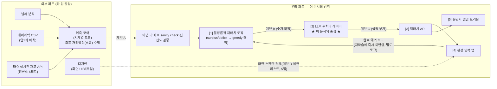

# 타슈브리프(TashuBrief) — 예측을 현장 행동으로 옮기는 AI 재배치 브리핑 시스템

**한 줄 정의**: 타슈 정류소별 수요 예측을 받아 결정론적 로직으로 재배치 계획(어디서 몇 대를 어디로)을 계산하고, **LLM이 그 계획을 현장 인력이 즉시 이해하고 행동할 수 있는 말로 번역·설명·수집하는 것**을 핵심 가치로 삼는 B2G 재배치 API + 현장 인력 앱.

- **기준일**: 2026-07-21 (2026 AI 기반 해커톤 썸머 캠프 본선 1일차)
- **상태**: 세 초안(llm-core / ops-workflow / judging-fit) + 3인 심사 종합, 최종 확정안 v1.0
- **대상 문서**: 서식2(문제정의&MVP개발계획서) 본선 발표 골격 대응, Core 1 + Supporting 2 구조

> 원안 "타슈캐스트"(B2C, 개인 이용자 대상 15분 뒤 재고소진 예측)를 대전 타슈 재배치 현장 인력과 운영기관(대전교통공사·지자체) 대상 B2G 도구로 피벗한다. 예측 코어(시계열+날씨)와 화면 디자인은 팀의 다른 파트가 만들고, 우리 파트는 그 사이를 잇는 **인터페이스 계약, 결정론적 재배치 로직, 그리고 이 문서의 중심축인 LLM 후처리 레이어**를 만든다.

---

## 1. 문제 정의 — 대전 지역 문제로서의 재배치 비효율

타슈 실시간 정류소 API는 `id, name, x_pos, y_pos, address, parking_count` 6개 필드만 제공한다(직접 API 기준; x_pos는 실제로 위도, y_pos는 실제로 경도로 필드명과 값이 뒤바뀌어 있다). 개별 자전거 ID·고장 필드·거치대 총 용량은 어디에도 없다. 즉 운영기관도 "지금 몇 대가 있는가"는 알아도 "정원 대비 얼마나 찼는가", "한 시간 뒤 몇 대가 남을 것인가"는 이 API만으로는 계산할 수 없다.

이 불확실성 위에서 재배치는 현장 인력의 경험적 순회에 크게 의존하는 것으로 보인다. 반복되는 문제는 두 가지다.

1. **원인**: 등하교·출퇴근 시간대에 대학가·환승 거점 등 특정 정류소는 대여가 몰려 재고가 급격히 줄고, 주거지·반납 거점은 자전거가 쌓여 거치 공간을 잠식한다. 대여이력 데이터(data.go.kr 15137219, 과제 지시문 기준 약 932만 행의 대여·반납 이벤트 로그)는 이 쏠림이 요일·시간대별로 반복되는 구조적 패턴임을 시사한다 — 다만 참고 자료마다 행수 표기가 416만~932만 행으로 갈려 있어, 이번 문서는 과제 지시문의 고정치(약 932만 행)만 인용하고 정밀한 실측치를 주장하지 않는다.
2. **결과**: 재배치 인력은 "지금 어디가 급한지"를 실시간으로 알기 어렵다. 감에 의존한 순회는 이미 충분한 정류소를 다시 방문하고 정작 급한 정류소를 늦게 방문하는 비효율을 낳는다. 트럭 1회 순회의 적재량·이동 거리는 한정돼 있어, 우선순위를 잘못 매기면 하루치 재배치 효과 전체가 떨어진다.

**핵심 사용자**: 재배치를 실제로 수행하는 **현장 인력(트럭 기사·상하차 인력)** 과 이들의 하루 순회를 설계·점검하는 **운영 담당자(대전교통공사 또는 위탁 운영사)**. 개인 이용자는 이번 피벗의 직접 사용자가 아니다.

**시장성 메모**: 실제 이용자(현장 인력)는 무료 사용자이고, 지불 주체는 운영기관이다. 재배치는 이미 매일 인건비·연료비가 발생하는 운영 비용 항목이므로 "같은 인력으로 더 정확한 순회"라는 효율화는 신규 예산이 아니라 기존 운영비 절감 논리로 파일럿 계약을 설득할 수 있다(9절에서 전국 확장 논리로 더 구체화한다).

**트럭·인력 운영 현황**: 실제 트럭 보유 대수, 1일 순회 횟수, 인력 규모에 대한 공식 자료는 확보하지 못했다 **[확인 필요]**. 이 문서의 데모·완료기준은 이 미지수에 의존하지 않도록 트럭 1대·정류소 8곳 규모로 범위를 좁혀 설계했다(4절).

---

## 2. 솔루션 개요 — Core 1 + Supporting 2

| 구분 | 기능명 | 한 줄 설명 |
|---|---|---|
| **Core** | 재배치 계획 생성 + LLM 작업 브리핑 | 예측 코어 출력을 결정론적 로직이 소비해 "A정류소 -6대 → B정류소" 계획을 산출하고, LLM이 이를 교대 브리핑·작업지시서·우선순위 설명으로 번역한다 |
| Supporting 1 | 현장 예외 보고 파싱 + 재계획 트리거 | 현장 인력의 자유 문장 예외 보고("여기 3대뿐이에요")를 LLM이 구조화 이벤트로 변환하고, 이 이벤트가 결정론적 재계획을 트리거한다 |
| Supporting 2 | 운영자 일일 리포트 | 하루 재배치 실적·미해결 정류소를 운영 담당자(B2G 구매자)용으로 자동 요약한다 — 파일럿 계약의 가치 증거 |
| Stretch(선택) | 현장 인력 Q&A | 오늘 계획 JSON 범위 안에서만 답하는 제한적 챗봇. 설계는 6.10에 포함하되 구현 우선순위는 낮다 |

**AI 제거 시 무엇이 사라지는가**: 재배치 계획(어디서 몇 대)은 결정론적 로직만으로도 나온다. 하지만 그 계획을 "왜 이 순서인지, 예외가 생기면 무엇을 뜻하는지"를 매 교대·매 정류소마다 사람이 이해할 문장으로 즉시 바꾸는 일, 그리고 자유 문장 예외 보고를 구조화된 재계획 신호로 바꾸는 일은 AI 없이는 사람이 수작업으로 해야 한다. 이것이 이 문서가 6절 LLM 후처리 레이어에 가장 많은 지면을 배분하는 이유이자 AI활용도 배점에 대응하는 핵심 논리다.

우리 파트가 **직접 만들지 않는 것**을 먼저 밝힌다 — 시계열 수요 예측 모델과 날씨 분석 로직, 화면 비주얼은 팀의 다른 파트가 만든다. 우리 문서는 예측 모델의 알고리즘을 규정하지 않고 5절의 입출력 계약만 요구한다.

---

## 3. 시스템 구성도 — 파트 경계



경계 원칙 두 가지: (1) 예측 코어의 알고리즘(모델 종류·정확도)은 우리가 주장하지 않는다 — 계약 A라는 입출력 인터페이스만 정의한다. 좌표 재라벨링(스왑) 책임도 이 경계 안에 포함된다 — `x_pos/y_pos` 원본을 `lat/lon`으로 재라벨링하는 작업은 계약 A를 생성하기 전 예측 코어 팀이 수행하고, 우리 어댑터는 그 결과가 대전 좌표 범위(위도 약 36.0~36.5, 경도 약 127.2~127.6) 안에 있는지 sanity check로 독립 검증할 뿐 스왑 자체를 재수행하지 않는다(Day1 10:00-11:00 협의로 고정, 5절 계약 A 규칙 (6)). (2) 디자인의 화면 비주얼도 규정하지 않는다 — 7절은 "어떤 화면이 몇 개, 무엇을 보여줘야 하는가"까지만 정의하고, 5절 말미의 경량 "계약 D" 체크리스트로 디자인 팀이 스킨을 입힐 때 알아야 할 상태·enum을 못박는다. 숫자(대수·정류소·순서)는 [1]에서 확정되고, [2] LLM은 그 숫자를 해석·번역·요약·질의응답할 뿐 새 숫자를 만들지 않는다.

---

## 4. Core 로직: 결정론적 재배치 계획 생성 (Greedy 매칭)

LLM 얘기를 하기 전에 LLM이 절대 손대지 않는 **숫자를 만드는 로직**부터 확정한다. 데모 범위는 충남대 인근 정류소 **8곳**, 트럭 **1대(용량 20대)**, 최대 이동 반경 **3km**로 고정한다(이 세 숫자는 문서 전체에서 동일하게 유지한다 — 검토 과정에서 트럭 용량이 절마다 15대/20대로 다르게 언급됐던 불일치를 재발시키지 않기 위함).

```
1. 각 정류소 i에 대해:
   surplus[i] = max(0, predicted_inventory[i] - recommended_band.max[i])
   deficit[i] = max(0, recommended_band.min[i] - predicted_inventory[i])

2. |surplus|, |deficit| < 2대인 정류소는 노이즈로 간주해 후보에서 제외

3. priority_score[i] = deficit[i] * urgency_weight(time_to_critical_min[i])
                        * confidence_weight(recommended_band.confidence[i])

   urgency_weight(t):   t < 15분 → 3.0(urgency=high)
                        /  15분 ≤ t ≤ 45분 → 2.0(urgency=medium)
                        /  t > 45분 → 1.0(urgency=low)
   confidence_weight(c): high → 1.0      /  medium → 0.7    /  low → 0.4

   urgency는 이 임계값으로 결정론적 로직이 함께 산출해 계약 B에 그대로 실어 보낸다 —
   6절의 LLM은 이 값을 계약 C에서 echo만 하고 새로 판정하지 않는다(5절 계약 B 규칙, 6.11 8계층).

4. 트럭 잔여 용량(20대)이 남아있는 동안:
   a. priority_score가 가장 높은 미해결 deficit 정류소 D를 선택
   b. D로부터 haversine 거리 3km 이내인 surplus 정류소 중 가장 가까운 S를 선택
      (없으면 D는 unresolved 처리)
   c. qty = min(surplus[S], deficit[D], 트럭 잔여용량)
   d. leg 생성: {from: S, to: D, quantity: qty, distance_km, priority_rank}
   e. surplus[S] -= qty, deficit[D] -= qty, 트럭 잔여용량 -= qty
   f. 모두 0이 되거나 트럭이 가득 차면 종료

5. 해결되지 못한 deficit/surplus는 unresolved 목록으로 남겨
   다음 배치 주기 또는 2호차 트럭으로 이월한다.
```

정류소 8곳 규모에서는 O(n log n) 정렬 + O(n·m) 탐색으로 충분히 가볍다. haversine 거리 계산 시 좌표는 반드시 lat/lon으로 정규화된 필드만 사용한다 — 타슈 API 원본 `x_pos/y_pos`는 위경도가 뒤바뀐 이름이므로, 예측 코어 팀이 계약 A 생성 전에 재라벨링(스왑)을 마친 값만 계약 A로 전달받는다. 우리 어댑터는 이 lat/lon이 대전 좌표 범위 안에 있는지를 sanity check로 재검증할 뿐 스왑을 직접 수행하지 않는다(3절, 5절 계약 A 규칙 (6)). 이 단계의 산출물(`plan.legs[]`)이 LLM 레이어의 유일한 숫자 출처다. **LLM은 이 계산을 다시 하지 않는다.**

**트럭 상태(내부 값)**: 위 알고리즘이 소비하는 트럭 잔여 용량은 하루 중 여러 leg를 거치며 계속 바뀌는 상태값이며, 계약 A/B/C 어디에도 등장하지 않는 내부 상태로 명시적으로 정의한다 — `truck_state: { remaining_capacity, current_load, last_completed_leg_id }`. 4절 알고리즘의 매 배치 실행과 6.7/6.8의 예외 기반 재계획 모두 이 `truck_state`를 참조해 트럭의 실제 현재 적재량을 반영하며, 재계획이라고 해서 매번 20대 풀capacity로 재시작하지 않는다.

---

## 5. 인터페이스 계약 — 예측 코어 → 재배치 로직 → LLM → 현장 앱

세 단계 계약을 분리하고, 작업 생명주기 상태값은 계약 A/B/C·현장 앱·DB 전체에서 **`created → assigned → in_transit → completed | exception`** 5개로 통일한다(이전 프로젝트에서 기획·개발 문서 간 필드명이 어긋나 실제 구현이 불가능했던 사고가 있었기 때문에, 이번에는 상태명을 하나의 표로 못박는다). 이 전이는 API 레이어가 소유한다 — 리그는 계약 B 산출 직후 `created`로 생성되고, 재배치 API가 이를 특정 트럭/작업자 세션에 배정해 전달하는 순간 `assigned`로 전이하며, 이후 현장 앱에서의 도착·완료 조작에 따라 `in_transit`→`completed|exception`으로 이어진다. **이 전이는 LLM 호출과 무관하다** — LLM은 자신이 받은 시점의 status 값을 그대로 echo할 뿐 상태를 산출·변경하지 않는다.

### 계약 A — 예측 코어 → 재배치 로직 (입력, 하루 4회 07:00/11:30/15:00/18:30 배치)

```json
{
  "batch_id": "fc-2026-07-21T07:00-v1",
  "generated_at": "2026-07-21T06:55:00+09:00",
  "model_version": "ts-weather-v0.3",
  "stations": [{
    "station_id": "TS-1042", "station_name": "충남대 정문",
    "lat": 36.3660, "lon": 127.3450,
    "raw_x_pos": 36.3660, "raw_y_pos": 127.3450,
    "current_stock": { "value": 3, "snapshot_at": "2026-07-21T06:50:00+09:00", "source": "direct_tashu" },
    "predicted_inventory": [{ "target_time": "2026-07-21T09:00:00+09:00", "expected_stock": 0, "ci_low": 0, "ci_high": 1 }],
    "recommended_band": { "min": 4, "max": 10, "method": "historical_p10_p90", "confidence": "medium" },
    "weather_context": { "issued_at": "2026-07-21T05:00:00+09:00", "temp_c": 29.5, "precip_prob": 10, "sky": "맑음" },
    "data_freshness_sec": 300, "fallback_mode": "none"
  }]
}
```

계약 규칙: (1) `station_id`는 타슈 실시간 API의 `id`와 1:1로 일치해야 한다. (2) `confidence`는 숫자 확률이 아닌 `low/medium/high` enum으로만 받는다 — 신뢰도를 열거형으로 좁혀 후단(LLM 포함)이 임의로 재해석할 여지를 없앤다. (3) `recommended_band.method`는 반드시 태그를 단다 — 거치대 총 용량 필드가 API에 없으므로 이 값은 실측 정원이 아니라 과거 관측치 기반 추정일 뿐이다. (4) 예측 코어가 배치를 못 채우면 `fallback_mode`를 `historical_fixture`/`stale_cache`/`unavailable` 중 하나로 명시해야 하며, 우리 쪽에서 0으로 채우지 않는다. (5) `target_stock`(정원 기반 목표치) 필드는 존재하지 않는다 — 필요하면 예측 코어가 별도로 확보해야 하며, 우리도 LLM도 이를 임의로 추정하지 않는다. (6) `lat/lon`은 예측 코어 팀이 원본 `x_pos/y_pos`를 재라벨링(스왑)한 값이며, 검증용으로 원본값을 `raw_x_pos/raw_y_pos`에 그대로 함께 싣는다 — 우리 어댑터는 `lat/lon`이 대전 좌표 범위(위도 36.0~36.5, 경도 127.2~127.6) 안에 있는지, 그리고 `raw_x_pos/raw_y_pos`와 `lat/lon`이 일치하는지를 sanity check로 독립 검증할 뿐 스왑을 재수행하지 않는다(3절·4절).

### 계약 B — 결정론적 재배치 로직 → LLM 레이어 (내부 전달, 숫자 확정)

```json
{
  "plan_id": "plan-2026-07-21T07:00-v1", "generated_at": "2026-07-21T07:02:10+09:00",
  "response_mode": "live",
  "legs": [{
    "leg_id": "leg-001", "status": "created", "truck_id": "truck-1", "sequence": 1,
    "from_station_id": "TS-2011", "from_station_name": "유성온천역",
    "to_station_id": "TS-1042", "to_station_name": "충남대 정문",
    "quantity": 4, "distance_km": 1.8, "priority_score": 5.6, "priority_rank": 1,
    "deficit_at_to": 4, "surplus_at_from": 9, "time_to_critical_min": 45, "urgency": "medium"
  }],
  "unresolved": [{ "station_id": "TS-3050", "issue": "deficit_unmatched", "deficit": 4, "reason": "트럭 용량 소진" }]
}
```

`quantity`, `from/to_station_id`, `priority_rank`, `urgency` 등은 이 시점에 이미 확정된 값이다. 6절의 LLM은 이 값들을 다시 계산하지 않고 계약 C에서 echo만 한다. `response_mode`는 `live`(예측 코어 정상 응답) / `demo`(리허설·시연용 고정 fixture) / `template_fallback`(예측 코어 또는 LLM 장애 시 결정론적 폴백) 세 값 중 하나로만 표기한다(7.2절 화면 1 배지, 6.12 폴백).

> **예시 수치 검증 근거**: 이 문서에 등장하는 모든 예시 수치(deficit, quantity, priority_score, urgency 등)는 §4/§6.2 공식으로 역산해 채운 값이다 — TS-1042는 `recommended_band.min=4`, 09:00 `expected_stock=0`이므로 `deficit=max(0,4-0)=4`; `quantity=min(surplus_at_from=9, deficit_at_to=4, 트럭 잔여용량=20)=4`; `time_to_critical_min=45`는 "15≤t≤45 → medium" 구간이므로 `urgency_weight=2.0`, `confidence=medium → confidence_weight=0.7`, `priority_score=4×2.0×0.7=5.6`이다. 임의로 채운 수치가 아니다.

### 계약 C — LLM 후처리 → 현장 앱 (최종 응답)

```json
{
  "leg_id": "leg-001", "status": "assigned",
  "echoed_from_station_id": "TS-2011", "echoed_to_station_id": "TS-1042", "echoed_quantity": 4,
  "urgency": "medium", "confidence_label": "medium",
  "reasoning": "충남대 정문은 약 45분 내 재고 고갈이 예상되며, 유성온천역은 여유 재고가 있어 이번 회차 첫 이동으로 배정되었습니다.",
  "referenced_fields": ["time_to_critical_min", "surplus_at_from", "deficit_at_to"],
  "caution_flags": []
}
```

세 계약 모두 `leg_id`/`station_id`를 그대로 되돌려주는(echo-back) 방식으로 이어져, 어느 단계에서도 값이 조용히 바뀌지 않게 추적 가능하다. `urgency`·`confidence_label`은 임의의 확률(%)이 아니라 반드시 enum으로만 표기하며, 두 값 모두 계약 B에서 이미 확정돼 넘어온 값을 echo한 것이다(6.11 8계층이 사후 대조한다).

### 계약 D — 디자인 파트 체크리스트 (경량)

예측 코어처럼 상세 JSON 계약을 맺지는 않지만, 디자인 팀이 화면 스킨을 입히기 전에 알아야 할 상태·enum을 한 곳에 못박는다(8절 Day1 17:00 블록에서 동기화).

| 구분 | 값 목록 | 등장 화면 |
|---|---|---|
| `response_mode` | `live` / `demo` / `template_fallback` | 화면 1 상단 배지 |
| `urgency` | `high` / `medium` / `low` | 화면 2 작업 카드 |
| `confidence_label` | `high` / `medium` / `low` | 화면 2 작업 카드 |
| `status` | `created`→`assigned`→`in_transit`→`completed`\|`exception` | 화면 2~4 |
| 재계획 배너 | `change_type: reordered/added/removed` | 화면 4 |
| 폴백 배지 | `response_mode: template_fallback` 노출 여부 | 전 화면 공통 |

---

## 6. LLM 후처리 레이어 설계 — 이 문서의 심장

이 절이 타슈브리프의 정체성이다. 예측 코어와 재배치 로직이 "무엇을, 몇 대를" 결정하면, LLM 레이어는 그 결과를 **일곱 개의 구체적 기능**(Core 3 + Supporting 2 + Stretch 1, 그리고 이를 관통하는 공통 설계 원칙)으로 나누어 사람에게 전달·수집·설명한다. 모든 기능은 동일한 경계를 지킨다 — **결정(숫자·순서·행동)은 상류에서 이미 끝났고, LLM은 해석·번역·요약·질의응답할 뿐 절대 새 숫자를 만들지 않는다.**

### 6.0 왜 이 경계인가 — v2 원칙과의 관계

팀이 이전에 정리해 둔 v2 마스터플랜은 "LLM은 확률·등급·대안·행동을 정하지 않는다"는 원칙을 뒀다. 이번 피벗에서도 이 원칙의 핵심(**LLM이 숫자를 새로 만들지 않는다**)은 그대로 유지한다. 다만 표현 범위는 명시적으로 확장한다 — 이동 대수·출발지·도착지·우선순위 점수·urgency 등급은 4절의 결정론적 로직만 정하고, LLM은 이 확정된 사실을 **해석·설명·소통·분류·요약**하는 후처리 레이어이되, 이 경계 안에서는 단순 포맷팅을 넘어 우선순위 근거 설명·예외 분류·재브리핑·일일 요약이라는 실질적 의사결정 가치를 최대한 담당한다. LLM 없이 현장 인력은 raw JSON의 `priority_score: 5.6` 같은 숫자만 보고 스스로 왜 급한지 해석해야 한다 — 이 해석 노동을 대신하는 것 자체가 핵심 가치이며, "AI를 제거하면 핵심 가치가 크게 떨어져야 한다"는 심사 원칙에 대한 답이다.

이 경계 안에서도 "단순 조건부 템플릿으로 충분한 것 아니냐"는 질문에는 구체 사례로 답한다 — 동일한 leg(예: leg-001)라도 날씨가 폭염 특보로 바뀌거나 인접 정류소에서 방금 `access_blocked` 예외가 접수된 상태라면, reasoning 문장은 "더위로 반납이 몰릴 가능성"·"인접 정류소 접근 제한으로 우회 경로 필요"처럼 서로 다른 근거 조합을 자연어로 구성한다 — if-else 템플릿이 감당하기 어려운 조합 폭발이다. 다만 이 조합 다양성 논증이 가장 강하게 성립하는 지점은 6.4~6.6보다는 자유 문장을 실제로 이해·분류해야 하는 6.7(예외 보고 파싱)과 여러 지표를 종합해야 하는 6.9(일일 리포트)이며, AI활용도 심사 대응의 무게중심도 그쪽에 둔다(9절).

### 6.1 공통 설계 원칙

- **경계**: 입력에 없는 station_id·수량·시각은 출력에도 등장할 수 없다. 등장하면 6.11절 가드레일이 차단한다.
- **모델 티어링**: Haiku 계열(경량) — 대량 정류소 1차 스크리닝·자유 문장 분류, Sonnet 계열 — 근거 있는 설명문·브리핑 생성, Opus 계열 — 상충하는 애매한 케이스의 선택적 에스컬레이션. 전체 legs 중 이미 우선순위가 명백한 저긴급 건은 Haiku 스크리닝 단계에서 걸러 템플릿 문장으로 충분하다고 판단하고 Sonnet 호출을 건너뛴다 — 이 필터링 비율이 전체 비용을 좌우하는 가장 큰 레버이며(전량 호출 대비 최대 수십 배 비용 차이), 2일 데모에서도 "왜 모든 leg마다 LLM을 부르지 않는가"에 대한 설계 근거가 된다.
- **호출 경로 분리**: 시각이 고정되지 않고 지연을 흡수할 수 있는 생성(일일 리포트, 6.9)만 Batch API(입출력 50% 할인)로 돌린다. 교대 브리핑(6.5)은 "교대 시작 전에는 반드시 존재해야 하는" 시각 고정 산출물인데, Batch API는 완료 시각을 보장하지 않는다(대부분 1시간 이내지만 최대 24시간까지 걸릴 수 있음 — 10절 리서치 근거). 이 시각 고정 요구 때문에 하루 4회뿐인 저빈도 호출이라는 점을 살려 교대 브리핑은 실시간 Messages API로 처리한다. 현장 예외 파싱처럼 즉시 응답이 필요한 것도 물론 실시간 Messages API다.
- **프롬프트 캐싱**: 판정 기준·출력 스키마·few-shot 예시를 고정 prefix로 두고 캐싱한다 — 교대마다 반복 호출되는 브리핑·작업지시서 생성 비용을 캐시 히트 시 대폭 절감한다.
- **되먹임 격리**: 현장에서 입력된 실측 재고·적재량은 예측 코어의 재학습 파이프라인에 즉시 반영하지 않고 별도 로그로 분리한다. 현장 확인치를 곧바로 학습 데이터로 흘려보내면 일시적 오류나 예외 상황이 다음 예측을 오염시킬 수 있기 때문이다.

### 6.2 프롬프트 구조 — 3단 템플릿 (전 기능 공통 골격)

```
[역할과 제약]
너는 대전 타슈 재배치 작업 지시문을 작성하는 보조자다.
- 입력 JSON에 있는 수치(quantity, station_id, 좌표, 점수)를 그대로 인용하라.
  새로운 수치를 계산하거나 추정하지 마라.
- confidence·urgency는 반드시 아래 enum 중 하나로만 답하라. 임의의 확률(%)을 쓰지 마라.
- 애매하거나 입력값이 비어 있으면 "확인 필요"로 표시하고 임의로 채우지 마라.

[판정 기준]
- urgency는 계약 B에 이미 포함된 값을 그대로 echo하라(새로 판정하지 마라).
  참고(감사용): urgency는 time_to_critical_min < 15분이면 high, 15분 ≤ t ≤ 45분이면 medium,
  t > 45분이면 low로 결정론적 로직이 계산한 값이다.
- confidence는 recommended_band.confidence를 그대로 반영하라.
- reasoning은 반드시 referenced_fields에 나열한 필드만 근거로 삼을 것

[출력]
아래 JSON 스키마를 그대로 따르라. additionalProperties는 허용하지 않는다.
{leg_id, reasoning, urgency, confidence, referenced_fields, ...기능별 필드}
```

기능마다 "판정 기준"과 "출력" 슬롯만 바뀌고 "역할과 제약"은 고정 prefix로 캐싱된다.

### 6.3 기능 요약표

| # | 기능 | 모델 | 호출 방식 | 구분 |
|---|---|---|---|---|
| 1 | 작업지시서 생성 | Sonnet | 실시간(배치 계획 산출 직후 일괄 사전 생성) | Core |
| 2 | 교대 시작 브리핑 | Sonnet | 실시간(로그인 시 즉시 생성) | Core |
| 3 | 우선순위 비교 설명 | Sonnet | 실시간 | Core |
| 4 | 예외 보고 파싱 | Haiku | 실시간 | Supporting 1 |
| 5 | 예외 이후 재브리핑 | Sonnet | 실시간 | Supporting 1 |
| 6 | 운영자 일일 리포트 | Sonnet | Batch(야간 1회) | Supporting 2 |
| 7 | 현장 Q&A | Sonnet, 상충 시 Opus 에스컬레이션 | 실시간 | Stretch |

### 6.4 기능 1 — 정류소별 작업 지시서 생성 (Core)

**입력**: 계약 B `legs[]` 중 1건 + 해당 정류소 `weather_context`.
**프롬프트 전략**: "역할과 제약 / 판정 기준 / 출력 스키마" 3단 구조. "재배치 대수·정류소·순서를 절대 바꾸지 않는다. 입력에 있는 필드만 인용해 2~4문장으로 이유를 설명하라"를 명시. few-shot 2~3개를 캐시 prefix에 포함.
**출력 스키마**: 계약 C(5절)와 동일. `reasoning`, `referenced_fields`, `recommended_check_on_arrival`("도착 시 실제 잔여 대수가 예측과 크게 다르면 예외 보고를 남겨주세요") 필드 포함.
**가드레일**: `quantity`·`from/to_station_id`·`urgency`·`confidence_label`은 echo-back만 허용(생성 금지) → 사후 문자열/값 대조로 변조 여부 검증(6.11 8계층). `reasoning` 내 모든 숫자를 정규식으로 추출해 입력 필드값과 대조, 불일치 시 응답 폐기 후 폴백 템플릿 대체.
**완료기준**: 준비된 정류소 8곳 중 6곳 이상에서 작업지시서가 10초 이내 생성되고, 이동 대수·정류소 ID가 입력값과 100% 일치.
**데모 장면**: 현장 인력이 앱에서 첫 작업 카드를 열면 대수·출발지·도착지는 그대로 보이고 그 아래 "왜"가 두세 문장 붙는다. 이어서 이 leg의 **원본 계약 B(raw JSON, 숫자만)** 화면과 **계약 C(LLM 지시문)** 화면을 나란히 띄워, "숫자는 로직이 만들고 설명은 AI가 만든다"는 것을 시각적으로 증명한다 — AI를 제거하면 사라지는 것이 정확히 이 비교 화면이다.

### 6.5 기능 2 — 교대 시작 브리핑 (Core)

**입력**: 오늘 배치 전체 `legs[]`(우선순위 정렬) + `unresolved[]` + 날씨 요약.
**프롬프트 전략**: 실시간 Messages API로 교대 시작 로그인 시점에 즉시 생성한다 — Batch API는 완료 시각을 보장하지 않아(대부분 1시간 이내~최대 24시간, 6.1·10절) "교대 시작 전 반드시 존재해야 하는" 이 산출물에는 부적합하다고 판단해 제외했다. 하루 4회뿐인 저빈도 호출이라 실시간 전환에 따른 비용 증가는 미미하다. "총 이동 건수, 상위 3건 요약, 날씨가 계획에 준 영향, 대응 못한 정류소가 있다면 그 이유"를 200자 내외로 요약하며, 판정 기준·출력 스키마·few-shot은 여전히 고정 prefix로 캐싱해 지연을 최소화한다.
**출력 스키마**: `{ shift, total_legs, top_priorities: [leg_id...], weather_note, unmet_note, summary_text }`.
**가드레일**: `total_legs`·`top_priorities`는 `legs[]` 배열 길이·순위와 서버 사이드에서 대조 검증(건수를 지어내면 폐기). `unmet_note`는 `unresolved[]`에 있는 station_id만 언급 가능.
**완료기준**: 교대 시작부터 브리핑 표시까지 3번 이하 조작, 10초 이내 로딩. 실시간 호출이 10초를 넘거나 실패하면 6.12 폴백표(기능 2)에 따라 우선순위 정렬된 원시 legs 목록을 즉시 대체 표시한다.
**데모 장면**: 교대 시작 화면을 열면 카드 한 장짜리 브리핑이 먼저 뜬다 — "현장 인력이 앱만 열면 오늘 뭘 해야 하는지 10초 안에 안다"는 완료기준을 시연.

### 6.6 기능 3 — 우선순위 비교 설명 (Core)

**입력**: 특정 leg 두 건과 그 근거 필드(예: 왜 A가 B보다 먼저인지).
**프롬프트 전략**: 단발 질의응답. "두 leg의 어떤 필드 차이가 순위를 갈랐는지만 말하라, 새 판단 기준을 만들지 말라"를 강제.
**출력 스키마**: `{ compare: [leg_id, leg_id], winner_leg_id, reasoning, referenced_fields }`.
**가드레일**: `winner_leg_id`는 이미 확정된 `priority_rank`와 서버가 대조해 반드시 일치해야 한다 — LLM이 순위를 뒤집는 답을 하면 응답을 버리고 결정론적 문장으로 대체한다.
**완료기준**: 준비된 비교 질의 10건 중 8건 이상에서 winner가 `priority_rank`와 100% 일치, 5초 이내 응답.
**데모 장면**: 현장 인력이 "왜 여기부터?"를 탭하면 즉시 근거가 뜬다 — 짧지만 "설명 가능한 재배치"라는 인상을 준다.

### 6.7 기능 4 — 현장 예외 보고(자유 문장) → 구조화 파싱 → 재계획 트리거 (Supporting 1)

**입력**: 현장 인력이 입력한 자유 문장. 예: "도착했는데 자전거가 3대밖에 없어요. 예측이랑 다르네요."
**프롬프트 전략**: 분류 전용 프롬프트(Haiku 계열, 저비용). 자유 문장 → 미리 정의된 이벤트 타입 enum(`inventory_mismatch`/`access_blocked`/`equipment_issue`/`demand_surge_observed`/`unclassified`)으로만 매핑. 새 타입 생성 금지, 애매하면 `unclassified`. LLM은 `event_type` 분류와 근거 텍스트만 산출하며, `severity`는 아래 서버 매핑표로 채운다.
**severity 산출 규칙(서버 규칙, LLM 비산출)**: `inventory_mismatch`는 `|observed_parking_count - current_stock.value|`가 5 이상이면 `high`, 2~4면 `medium`, 그 외는 `low`. `demand_surge_observed`는 고정 `high`(즉각 재계획 대상). `access_blocked`/`equipment_issue`는 고정 `medium`(현장 안전 이슈로 간주). `unclassified`는 고정 `low`. LLM 출력에 `severity`가 포함돼 있어도 이 서버 계산값으로 강제 치환한다(6.11 8계층과 동일 원칙).
**출력 스키마**: `{ report_id, leg_id, station_id, event_type, severity, extracted_numbers: { observed_parking_count }, confidence, triggers_replan }`.
**가드레일**: `extracted_numbers`는 원문에서 정규식으로도 재추출해 LLM 추출값과 대조 — 불일치 시 `unclassified`로 강등. `triggers_replan=true`는 `severity`가 medium 이상이고 `event_type`이 `inventory_mismatch`/`demand_surge_observed`일 때만 애플리케이션이 규칙으로 허용한다(LLM이 스스로 true/false를 정하지 않는다). 재계획 자체는 예측 코어를 재호출하지 않는다 — 마지막 계약 A 배치 스냅샷에서 예외 보고된 정류소의 `current_stock`/`predicted_inventory`만 현장 관측치로 덮어쓰고, 4절의 `truck_state`를 그대로 반영해 4절 greedy 로직을 재실행한다. LLM은 "무엇이 왜 바뀌었는지"만 다시 설명한다(기능 5).
**완료기준**: 준비된 예외 문장 10개 중 8개 이상 올바른 `event_type`으로 분류, `triggers_replan=true` 시 5초 이내 재계획 알림 표시.
**데모 장면**: 현장 인력이 짧은 텍스트를 입력 → 2초 내 구조화된 이벤트로 바뀌고 → 4절 로직이 다음 정류소 배정을 즉시 조정하는 알림이 뜬다. 이어서 **예측 코어를 라이브로 강제 종료**해 화면 상단에 `response_mode: template_fallback` 배지가 뜨는 것을 실시간으로 보여준다 — "예측이 틀리거나 늦어도 시스템이 멈추지 않는다"는 완성도를 눈으로 증명하는 장면이다.

### 6.8 기능 5 — 예외 이후 재브리핑 (Supporting 1 연계)

**입력**: 재계산된 계약 B(변경분) + 트리거된 예외 이벤트.
**프롬프트 전략**: "무엇이 왜 바뀌었는지"만 재생성하고 새 우선순위 숫자는 만들지 않는다.
**출력 스키마**: `{ leg_id, change_type: "reordered"|"added"|"removed", reason_text, referenced_fields }`.
**가드레일**: `change_type`은 서버가 계약 B 재계산 전/후 diff로 사전에 결정하고 LLM에 그대로 넘긴다 — LLM은 이 값을 재판단하지 않는다. 이 재계산 역시 6.7과 동일하게 예측 코어를 재호출하지 않고 마지막 배치 스냅샷 + 현장 관측치 + `truck_state`만으로 4절 로직을 재실행한 결과다.
**완료기준**: 예외 트리거 후 5초 이내 재브리핑 배너 표시.
**데모 장면**: 재계획 알림 배너로 "다음 목적지가 바뀌었습니다 — 사유: 재고 불일치"가 뜬다.

### 6.9 기능 6 — 운영자 일일 리포트 (Supporting 2, B2G 가치 증거)

**입력**: 하루치 `plan_id` 이력 + 예외 보고 집계 + `unresolved` 목록.
**프롬프트 전략**: Batch API로 야간 생성. "오늘 처리한 이동 건수, 예외 보고 건수·유형 분포, 미해결 정류소와 그 이유"를 보고서 톤으로 요약.
**출력 스키마**: `{ report_date, total_legs_completed, total_legs_planned, exception_reports: {...}, unmet_stations, summary_text }`.
**가드레일**: 모든 집계 수치는 서버 로그가 직접 카운트한 값이며, LLM은 `summary_text`만 작성한다 — 스키마 자체에 LLM이 채울 숫자 필드를 두지 않는 것이 가장 강력한 가드레일이다.
**완료기준**: 하루 종료 시 리포트 생성, 모든 집계 수치가 서버 로그와 100% 일치.
**데모 장면**: 운영자 화면에서 "오늘 하루" 카드를 열면 표(수치, 결정론적)와 문단(요약, LLM)이 나란히 붙어 있다 — B2G 구매자에게 "이게 파일럿 계약의 가치"라는 것을 보여주는 화면.

### 6.10 기능 7 — 현장 인력 Q&A (Stretch)

**입력**: 오늘 배치 전체 + 예외 이력 + 자유 질문("다음 정류소까지 얼마나 남았어요?").
**프롬프트 전략**: RAG형 질의응답 — 답변 근거를 오늘 배치 데이터로만 제한. "제공된 데이터에 없는 정보는 모른다고 답하라"를 명시(환각 방지 1차 방어선).
**가드레일**: 근거 필드가 하나도 없는 답변은 출력하지 않고 "현재 데이터로는 답하기 어렵습니다. 운영자에게 문의해주세요"로 강제 대체.
**데모 우선순위**: Core·Supporting 시연 이후 여유 시간에만 보여준다. 문서에는 설계까지만 포함한다.

### 6.11 환각 방지 가드레일 — 8계층

1. 출력 스키마에 애초에 새 숫자를 담을 필드를 만들지 않는다(대수·건수는 전부 echo-back 또는 서버 카운트).
2. `referenced_fields`를 실제 입력 필드명 목록과 대조 검증한다.
3. `reasoning`/`summary_text` 내 모든 숫자를 정규식으로 추출해 입력값과 사후 대조한다. 숫자뿐 아니라 `weather_context.sky`·정류소명 같은 비숫자 컨텍스트 값도 원문 문자열과 대조하고, 최소한 방향성 오류(예: deficit 정류소를 두고 "여유"·"충분" 계열 표현이 반대 방향으로 등장하는지)를 규칙 기반으로 후검사한다.
4. JSON 스키마 강제(`additionalProperties: false`)로 구조 자체를 벗어난 응답을 원천 차단한다.
5. 경계값 상황은 LLM 호출 전에 애플리케이션이 먼저 "보류"를 강제한다 — 이 재배치 도메인에서는 신뢰도 낮음(confidence=low), 데이터 신선도 임계 초과, 그리고 동일 정류소가 연속 배치 주기에서 deficit↔surplus로 반복 전환되거나 confidence가 연속 두 배치 이상 하락하는 경우를 가리킨다.
6. 원본 응답 + 프롬프트 버전 + 모델 ID + request_id를 전부 로깅해 재현 가능하게 한다.
7. `stop_reason`이 정상 종료(`end_turn`)가 아니면 그 응답은 쓰지 않고 즉시 폴백 처리한다.
8. `urgency`·`confidence_label`처럼 규칙 기반으로 결정되는 enum은 서버가 근거 필드(`time_to_critical_min`, `recommended_band.confidence`)로 동일 규칙을 재계산해 LLM 출력과 대조하고, 불일치 시 서버 계산값으로 강제 치환한다(6.7의 `severity`도 동일 원칙).

### 6.12 LLM 장애 시 폴백

LLM 호출이 실패·타임아웃·거부되면, 기능별로 아래 결정론적 폴백을 즉시 적용한다. 재시도는 최대 1회로 제한해 재시도 폭주를 막는다. 이 폴백 문구·화면은 "AI 생성"이라 표시하지 않는다 — 실제로 AI가 만든 것이 아니기 때문이다. 대신 화면 상단에 `response_mode: template_fallback` 배지를 정직하게 노출해, 현장 인력이 지금 어떤 신뢰 수준의 정보를 보는지 항상 알게 한다.

| # | 기능 | 폴백 동작 |
|---|---|---|
| 1 | 작업지시서 | 동일한 `leg_id`/`urgency`/`quantity`로 결정론적 템플릿 문장 즉시 대체: `"{from_station_name}에서 {to_station_name}로 {quantity}대 이동하세요. 우선순위 {priority_rank}."` |
| 2 | 교대 브리핑 | 내러티브 없이 `legs[]`를 `priority_rank` 순으로 정렬한 원시 목록을 그대로 표시(summary_text 생략) |
| 3 | 우선순위 비교 | `winner_leg_id`를 `priority_rank`로 즉시 결정하고, reasoning은 "priority_score 기준 상위" 같은 고정 문구로 대체 |
| 4 | 예외 보고 파싱 | `event_type='unclassified'`, `severity` 미정으로 강등해 운영자 수동 확인 큐로 즉시 라우팅한다(보고 자체의 유실을 막는 것이 최우선) |
| 5 | 재브리핑 | "다음 목적지가 변경되었습니다" 고정 배너 문구 + 변경된 `leg_id` 나열만 표시 |
| 6 | 운영자 일일 리포트 | `summary_text` 없이 집계 수치(표)만 표시 |
| 7 | 현장 Q&A | 6.10에 정의된 "현재 데이터로는 답하기 어렵습니다" 고정 문구로 대체(이미 자체 정의됨) |

예측 코어 자체가 응답하지 못하는 더 상위 장애는 6.1의 되먹임 격리 원칙과 별개로 10절에서 다룬다.

---

## 7. 현장 인력 앱 — 화면 흐름

### 7.1 트럭 기사 K씨의 하루

K씨는 06:50 출근해 오늘 배정된 트럭을 확인하고 앱에 로그인한다(사번+PIN, 개인정보 최소화). 07:00, 예측 코어의 첫 배치 주기에 맞춰 1회차 계획이 도착한다. K씨는 순서대로 정류소를 돈다 — 도착하면 앱이 "몇 대를 싣고/내리고, 왜 이 순서인지"를 보여준다. 대부분은 계획대로 진행되지만, 가끔 현장 재고가 예측과 다르거나 접근이 막힌 경우가 있다 — 이때 실제 수량을 입력하거나 예외를 보고한다. 예외가 심각하면 운영자에게 즉시 알림이 가고, 이후 계획은 다음 배치 주기에 자동 반영된다. 11:30, 15:00, 18:30 배치마다 같은 흐름이 반복되고, 18:00 무렵 퇴근 전 K씨는 오늘 하루 요약을 확인하고 근무를 종료한다.

이 서사에서 역할은 명확하다 — **앱은 계획을 보여주고 실제값을 수집하는 창구**, **LLM은 그 계획과 예외를 사람이 바로 알아들을 말로 바꾸는 통역**이다.

### 7.2 화면 5개

1. **교대 시작 화면**: 6.5 브리핑 카드 + 오늘 이동 목록(우선순위 순). 상단 배지: 계획 생성 시각, 데이터 신선도, `response_mode`(live/demo/template_fallback). 완료기준: 로그인부터 목록 표시까지 3번 이하 조작, 10초 이내.
2. **작업 카드 화면**: 선택한 leg의 6.4 작업지시서(대수·출발/도착·지도·우선순위·이유 2~4문장) + "도착" 버튼. 완료기준: 설명 텍스트가 항상 `referenced_fields` 근거를 포함(6.11 가드레일 2).
3. **도착 확인 & 예외 보고 화면**: 실제 확인 대수 입력(+/- 버튼, 3번 이하 조작) + 자유 문장 입력창(6.7로 전송) + "정상 완료" 버튼. 실제값은 별도 로그로만 남고 예측 재학습에는 즉시 반영되지 않는다(6.1).
4. **재계획 알림 화면**: 예외 보고로 트리거된 재계획이 있으면 상단 배너로 "다음 목적지가 바뀌었습니다" + 변경 사유 한 줄(6.8).
5. **(운영자용) 일일 리포트 화면**: 6.9 리포트 카드. 현장 앱과는 별도 뷰다.

**인증 모델**: 화면 1~4와 화면 5는 계정 종류가 다르지만, 2일 MVP 범위에서는 별도의 이중 인증 시스템을 새로 만들지 않는다 — 단일 로그인(사번+PIN) 위에 `role: field_worker | operator` 필드 하나로 화면 접근을 분기한다. 다만 이 역할 필드명은 API 계약·DB·화면 문서 세 곳에서 처음부터 동일하게 고정한다(과거 인증 모델 불일치가 실제 구현 불가 사고로 이어진 사례가 있어, 가벼운 구현이라도 이름만은 못박아 둔다).

---

## 8. 2일 실행 계획

| 시간대 (Day1, 07-21) | 우리 파트 작업 |
|---|---|
| 09:00–10:00 | 킥오프, 역할 재확인(예측코어·디자인 타 파트), data.go.kr 인증키 발급/활성화 여부 짧은 스모크 확인(병행) |
| 10:00–11:00 | 예측 코어 팀과 계약 A 필드 협의·동결(좌표 스왑은 예측 코어 팀 책임, 우리 어댑터는 sanity check만 수행하는 것으로 합의) |
| 11:00–13:00 | 정류소 8곳 fixture 작성 + greedy 매칭 로직(4절) 구현 시작 |
| 13:00–14:00 | 점심 |
| 14:00–17:00 | greedy 매칭 로직 완성 + 단위테스트, LLM 시스템 프롬프트(6.4~6.5) 초안 |
| 17:00–19:00 | 6.4 작업지시서 파이프라인 연결, 가드레일(echo-back, 숫자 사후검증) 구현 + 디자인 팀과 계약 D(화면 상태·enum 체크리스트, 5절) 동기화 |
| 19:00–19:20 | 예측 코어 팀의 부분/스텁 라이브 출력으로 계약 A 스키마 파싱 스모크 테스트(조기 불일치 발견용) |
| 19:20–19:50 | 저녁 |
| 19:50–21:30 | 6.5 교대 브리핑 연결(실시간 API), 6.12 폴백 표 구현, 현장앱 화면 1·2 연동 |
| 21:30–22:00 | 1일차 통합 점검(fixture 기반 end-to-end), 다음날 계획 공유 |

| 시간대 (Day2, 07-22) | 우리 파트 작업 |
|---|---|
| 09:00–10:30 | 6.7 예외 보고 파싱 + 재계획 트리거, 6.8 재브리핑, 화면 3·4 연동 |
| 10:30–12:00 | data.go.kr 자동승인 경로 연동 시도, 실패 시 fixture 폴백 전환 테스트 |
| 12:00–13:00 | 점심 |
| 13:00–14:00 | 6.9 운영자 리포트 연결, 화면 5 연동, 6.6 우선순위 설명 |
| 14:00–15:00 | 전체 통합 리허설(8.1절 2분 시나리오), 예측 코어 강제 실패 → 폴백 전환 리허설 |
| 15:00–16:00 | 발표자료 정리(서식2 골격), 예상 질의응답 준비 |
| 16:00–16:30 | 최종 리허설 |

### 8.1 데모 시나리오 (초 단위, 2분)

- **00:00–00:20** "타슈 정류소는 시간대마다 자전거가 쏠립니다. 현장 인력은 감으로 재배치 순서를 정하고 있습니다." (화면: 재고 쏠림 지도)
- **00:20–00:45** "예측 코어가 3시간 뒤 예상 재고를 계산하면, 저희 로직이 몇 대를 어디로 옮길지 결정론적으로 정합니다." (화면: 계약 B raw JSON — 숫자만)
- **00:45–01:15** "이 숫자를 LLM이 현장 인력이 바로 이해할 지시문으로 바꿉니다." — raw JSON 화면과 계약 C(LLM 지시문) 화면을 나란히 비교 (화면: before/after)
- **01:15–01:35** 준비된 예외 문장("자전거가 3대뿐이에요")을 입력 → 2초 내 구조화 파싱 + 재계획 알림 (화면: 예외 보고 → 재브리핑)
- **01:35–01:55** 예측 코어를 라이브로 강제 종료 → `response_mode: template_fallback` 배지가 뜨며 데모가 멈추지 않는 것을 시연 (화면: 폴백 배지)
- **01:55–02:00** "숫자는 로직이, 설명은 AI가" 한 문장으로 아키텍처 요약

---

## 9. 심사 배점 대응

| 배점 항목(본선) | 대응 논리 |
|---|---|
| 실용성·시장성 (35, 최대) | 지불 주체는 운영기관이며 재배치는 이미 매일 발생하는 인건비·연료비 지출 항목이다 — 신규 예산이 아닌 운영비 절감 논리로 파일럿 계약 전환이 현실적이다. 나아가 국내 다른 공영자전거(서울 따릉이, 세종 어울링, 울산 피프틴 등)도 정류소 단위 집계만 제공하고 개별 자전거 데이터를 공개하지 않는다는 구조적으로 유사한 데이터 제약을 갖는 것으로 보인다 **[확인 필요: 실제 기술표준(GBFS 등) 구현 여부는 검증하지 않았다]**. 계약 A/B/C가 정류소 단위로 설계되어 있어 타슈에 종속되지 않고 이런 유사 제약을 가진 다른 지자체 사업자에도 이식 가능성이 있다 — 시장 규모를 대전 한 도시가 아니라 전국 공영자전거 운영사로 넓히는 근거다. |
| AI활용도 (25) | 예측 코어(외부 파트)는 "무엇이 얼마나 부족해질까"를 계산하고, LLM 후처리(우리 파트)는 "그래서 사람이 무엇을 언제 왜 해야 하는가"를 설명한다. LLM을 빼면 계약 B의 숫자 나열만 남아 현장 인력이 근거 없이 지시만 받는다 — 데모에서 raw JSON과 LLM 지시문을 나란히 보여줘(8.1절) 이 차이를 시각적으로 증명한다. 특히 6.7(자유 문장 예외 보고 분류)과 6.9(하루치 지표 종합 요약)는 조건부 템플릿으로 대체하기 어려운 실제 자연어 이해·생성이 필요한 지점이며, AI활용도 논증의 핵심 근거로 삼는다. |
| 창의성 (15) | "예측 코어 출력을 그대로 노출"하는 흔한 방식 대신, 결정론적 계획과 LLM 해석을 분리하고 그 경계를 8계층 가드레일로 명시한 아키텍처 자체가 차별점이다. 원안의 Supporting 기능("운영자 과밀 카드")을 이번 Core로 승격시킨 재구성이라는 점도 강조한다. |
| 완성도 (15) | Core(6.4·6.5) + Supporting 1(6.7·6.8) + Supporting 2(6.9)의 완료기준이 모두 수치로 정의되어 있고, 예측 코어를 라이브로 강제 실패시켜도 fixture 폴백으로 데모가 끊기지 않는다는 것을 실시간으로 증명한다. |
| 발표력 (10) | 8.1절의 2분 시나리오가 초 단위로 완전히 스크립트화되어 있어 리허설이 명확하다. |

**우리 파트 완료기준 총괄**(예측 코어의 정확도 기준과는 분리): Core는 정류소 8곳 시나리오 중 6곳 이상에서 작업지시서가 10초 이내 생성되고 이동 대수·정류소 ID가 입력값과 100% 일치하며, 현장 인력이 3번 이하 조작으로 다음 행동을 결정할 수 있다. Supporting 1은 예외 문장 10개 중 8개 이상이 올바른 event_type으로 분류되고 재계획 트리거가 5초 이내 반영된다. Supporting 2는 하루 종료 시 리포트의 모든 집계 수치가 서버 로그와 100% 일치한다.

---

## 10. 리스크와 정직한 한계

| 리스크/한계 | 대응 |
|---|---|
| 개별 자전거 단위 지시 불가 | 타슈 API는 정류소당 6필드(id, name, x_pos, y_pos, address, parking_count)만 제공하고 개별 자전거 ID·고장 상태·거치대 총 용량이 없다. 재배치 계획은 처음부터 "정류소 A에서 B로 몇 대"라는 집계 단위로만 설계했다 — 설계 실수가 아니라 데이터 계약의 한계다. |
| 좌표 필드 반전 | `x_pos`는 위도, `y_pos`는 경도로 필드명과 값이 뒤바뀌어 있다. 재라벨링(스왑)은 예측 코어 팀이 계약 A 생성 전에 수행하고, 우리 어댑터는 대전 좌표 범위 sanity check로 독립 검증한다(3절·5절) — 책임 소재를 명확히 해 두지 않으면 모든 화면의 위치가 조용히 어긋날 수 있는 흔한 함정이다. |
| 거치대 총 용량 미확보 | "정원이 몇인지" 데이터가 API에 없어 목표 재고율을 계산할 수 없다. `recommended_band`는 실측 정원이 아니라 과거 관측치 기반 추정(`method` 태그로 명시)이며, 이번 MVP는 순증감(net flow) 기준으로만 우선순위를 정한다. |
| 예측 코어 지연/실패 | 대여이력 CSV를 요일·시간대별로 사전 집계한 historical fixture로 즉시 전환하고, `fallback_mode`/`response_mode: template_fallback` 배지로 항상 정직하게 표시한다. |
| 타슈 실시간 API 인증키 발급 지연 | data.go.kr 자동승인 경로(전국 통합 15126639, 개발 5,000회/일)를 우선 사용하고 저장된 응답 JSON 스냅샷을 백업으로 준비한다. 이 데이터셋 번호·한도는 참고 자료마다 다르게 확인되어(예: 15109253/10,000회 표기도 존재) 실사용 전 재검증이 필요하다 — Day1 오전 킥오프 시간에 인증키 활성화 여부만 먼저 짧게 스모크 확인한다(8절). |
| 대여이력 CSV 행수 불일치 | 과제 지시문 고정치(약 932만 행)만 인용하고, 참고 자료 간 표기 불일치(416만 행 표기 등)를 실측 검증 없이 확정치처럼 서술하지 않는다. |
| 재배치 지시의 과신 | "예측/제안"이며 확정 명령이 아님을 앱 문구로 명시하고, urgency·confidence는 항상 enum(낮음/중간/높음)으로 표시해 최종 판단은 현장 인력·운영자에게 남긴다. |
| 트럭·인력 운영 현황 미확인 | 실제 트럭 대수, 1일 순회 횟수, 인력 규모는 공식 자료를 확보하지 못했다 [확인 필요]. 트럭 1대·용량 20대·정류소 8곳이라는 데모 가정치는 실제 파일럿 전환 시 운영기관과 재검증이 필요하다. |
| 현장 실측치의 예측 오염 위험 | 현장에서 입력한 실제 적재량은 예측 코어 재학습 파이프라인에 즉시 되먹이지 않고 별도 로그로 분리한다(6.1) — 일시적 예외가 다음 예측을 오염시키는 것을 막기 위함이다. |
| 대용량 이력 데이터 처리 | 약 932만 행 전체를 프론트에 올리지 않고, 선정한 정류소 8곳·시간대만 사전 집계해 사용한다. |
| LLM 응답 지연/비용 | 일일 리포트처럼 시각이 고정되지 않은 생성만 Batch API로 돌리고, 교대 브리핑처럼 시각이 고정된 산출물과 예외 파싱·작업지시서처럼 즉시 응답이 필요한 것은 실시간 처리해 비용과 지연을 분리 관리한다(Batch API는 완료 시각을 보장하지 않으므로 시각 고정 산출물에는 쓰지 않는다, 6.1). |
| 개인정보 | 현장 앱은 사번·역할 정도만 수집하고, 위치는 근무시간 중 배차 목적으로만 사용하며 그 이상은 저장하지 않는다. |

---

*본 문서는 비공식 해커톤 MVP 프로토타입 기획안이며, 타슈 운영기관의 공식 승인이나 실 서비스 적용을 전제하지 않는다. [확인 필요]로 표시된 항목은 해커톤 기간 내 검증되지 않은 가정이다.*